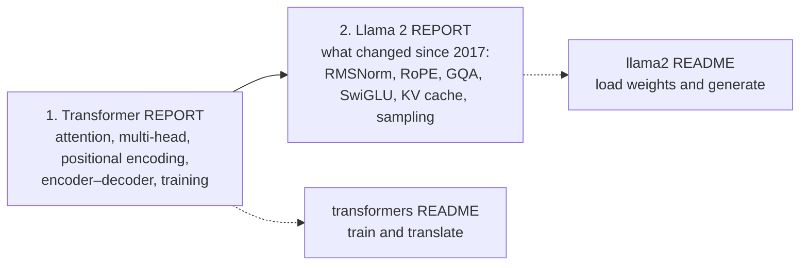

# Transformers from Scratch

Two Transformer models implemented from scratch in PyTorch, each with a walkthrough of how it works that follows its research paper:

| Project | Paper | What it does | Start here |
|---|---|---|---|
| [**`transformers/`**](transformers) | Vaswani et al. (2017), *Attention Is All You Need* | The original encoder–decoder Transformer, trained for English → Indonesian translation | [README](transformers/README.md) · [Report](transformers/REPORT.md) |
| [**`llama2-from-scratch/`**](llama2-from-scratch) | Touvron et al. (2023), *Llama 2* | A decoder-only language model that loads Meta's Llama 2 weights and generates text | [README](llama2-from-scratch/README.md) · [Report](llama2-from-scratch/REPORT.md) |

Each project has two documents:

- **`REPORT.md`** explains **how the model works**, section by section, following the paper: the equations, why each design choice was made, diagrams, and links into the exact class or function that implements each idea.
- **`README.md`** explains **how to use the code**: setup, commands, configuration, tests, and how the code is organised.

## Suggested reading order

The second model is a direct descendant of the first, so read them in order:



1. [**Transformer report**](transformers/REPORT.md): scaled dot-product and multi-head attention, sinusoidal positional encoding, the encoder and decoder stacks, masking, label smoothing, the warm-up learning-rate schedule, and greedy decoding.
2. [**Llama 2 report**](llama2-from-scratch/REPORT.md): opens with a table of [what changed between the two models](llama2-from-scratch/REPORT.md#1-from-the-2017-transformer-to-llama-2), then covers RMSNorm, rotary embeddings, grouped-query attention, the KV cache, SwiGLU, loading Meta's weights, and top-p sampling.

## Quick start

Each project has its own dependencies. Run the commands from inside the project folder.

**Transformer (translation)**

```bash
cd transformers
pip install -r requirements.txt
python -m pytest -q tests                      # 18 tests, CPU, a few seconds
python train.py                                # downloads OPUS-100 en-id on first run, then trains
python translate.py "I like to eat fried rice."
```

**Llama 2 (text generation)**

```bash
cd llama2-from-scratch
pip install -r requirements.txt
python -m pytest -q tests                      # 16 tests on a tiny random model, no weights needed
python inference.py --prompt "The capital of Indonesia is"
```

`inference.py` needs Meta's Llama 2 7B weights (`llama-2-7b/` and `tokenizer.model`), which are gated behind Meta's license. See [Getting the Llama 2 weights](llama2-from-scratch/README.md#getting-the-llama-2-weights).

## Repository layout

```text
.
├── transformers/               # Attention Is All You Need (2017), encoder–decoder translation
│   ├── model.py                #   the architecture
│   ├── dataset.py              #   tokenisation, padding, masks
│   ├── train.py                #   training loop, learning-rate schedule, validation
│   ├── translate.py            #   greedy decoding + command-line translator
│   ├── config.py               #   hyperparameters
│   ├── tests/                  #   pytest suite
│   ├── README.md · REPORT.md
│   └── tokenizer_en.json · tokenizer_id.json
└── llama2-from-scratch/        # Llama 2 (2023), decoder-only language model
    ├── model.py                #   the architecture (RMSNorm, RoPE, GQA, KV cache, SwiGLU)
    ├── inference.py            #   weight loading, top-p generation, command-line tool
    ├── tests/                  #   pytest suite
    └── README.md · REPORT.md
```

Datasets, checkpoints, TensorBoard logs and Meta's weights are created locally and are not committed (see the `.gitignore` files).
