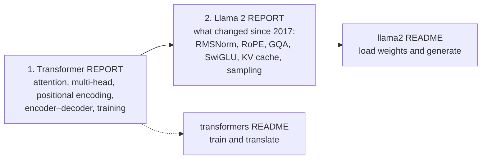

# My Journey in AI: Building Models From Scratch

Welcome to my repository! This space documents my journey as an AI Engineer, with a focus on understanding core concepts by implementing cutting-edge models from the ground up using PyTorch. The philosophy here is that true understanding comes from building. By manually coding each component, from data loaders to attention mechanisms, the goal is to demystify the inner workings of these complex architectures and cultivate a strong, first-principles-based foundation in AI.

---

## Completed Projects

| Project | Paper | What it does | Start here |
|---|---|---|---|
| [**`transformers/`**](transformers) | Vaswani et al. (2017), *Attention Is All You Need* | The original encoder–decoder Transformer, trained for English → Indonesian translation | [README](transformers/README.md) · [Report](transformers/REPORT.md) |
| [**`llama2-from-scratch/`**](llama2-from-scratch) | Touvron et al. (2023), *Llama 2* | A decoder-only language model that loads Meta's Llama 2 weights and generates text | [README](llama2-from-scratch/README.md) · [Report](llama2-from-scratch/REPORT.md) |

Each project has two documents:

- **`REPORT.md`** explains **how the model works**, section by section, following the paper: the equations, why each design choice was made, diagrams, and links into the exact class or function that implements each idea.
- **`README.md`** explains **how to use the code**: setup, commands, configuration, tests, and how the code is organised.

### 1. Transformer from Scratch

* **Description**: A complete implementation of the original Transformer model from the "Attention Is All You Need" paper. This project serves as a foundational exercise, focusing on the encoder-decoder architecture to solve a real-world Neural Machine Translation (NMT) task: translating from English to Indonesian using the Helsinki-NLP/opus-100 dataset.

* **Key Features**: This implementation includes all the critical components that made the Transformer revolutionary, such as **Multi-Head Self-Attention**, which allows the model to weigh the importance of different words in a sequence simultaneously, and sinusoidal **Positional Encoding** to give the model a sense of word order. It also features distinct **Encoder/Decoder stacks**, **Layer Normalization** and residual connections for stable training, and the paper's **warm-up learning-rate schedule** and **weight sharing**.

* **Directory**: `transformers/` · [**➡️ README**](./transformers/README.md) · [**➡️ Report**](./transformers/REPORT.md)

### 2. Llama 2 from Scratch

* **Description**: A from-scratch implementation of the Llama 2 decoder-only architecture. This project moves beyond the original Transformer to explore the specific optimizations and architectural refinements that make modern Large Language Models (LLMs) like Llama 2 so efficient and powerful for text generation. It loads Meta's pretrained weights and generates text with top-p sampling.

* **Key Features**: The code highlights several key innovations. **RMSNorm** is used for pre-normalization, offering a computationally simpler yet effective alternative to LayerNorm. **Rotary Positional Embeddings (RoPE)** are implemented to more effectively encode relative positional information. For efficiency, the model uses **Grouped-Query Attention (GQA)**, which significantly reduces the memory and computation required during inference, and a **KV Cache** to make auto-regressive generation much faster. Finally, the **SwiGLU** activation function is used in the feed-forward layers for improved performance.

* **Directory**: `llama2-from-scratch/` · [**➡️ README**](./llama2-from-scratch/README.md) · [**➡️ Report**](./llama2-from-scratch/REPORT.md)

---

## Suggested Reading Order

The second model is a direct descendant of the first, so read them in order:



1. [**Transformer report**](transformers/REPORT.md): scaled dot-product and multi-head attention, sinusoidal positional encoding, the encoder and decoder stacks, masking, label smoothing, the warm-up learning-rate schedule, and greedy decoding.
2. [**Llama 2 report**](llama2-from-scratch/REPORT.md): opens with a table of [what changed between the two models](llama2-from-scratch/REPORT.md#1-from-the-2017-transformer-to-llama-2), then covers RMSNorm, rotary embeddings, grouped-query attention, the KV cache, SwiGLU, loading Meta's weights, and top-p sampling.

## Quick Start

Each project has its own dependencies. Run the commands from inside the project folder.

**Transformer (translation)**

```bash
cd transformers
pip install -r requirements.txt
python -m pytest -q tests                      # 18 tests, CPU, a few seconds
python train.py                                # downloads OPUS-100 en-id on first run, then trains
python translate.py "I like to eat fried rice."
```

**Llama 2 (text generation)**

```bash
cd llama2-from-scratch
pip install -r requirements.txt
python -m pytest -q tests                      # 16 tests on a tiny random model, no weights needed
python inference.py --prompt "The capital of Indonesia is"
```

`inference.py` needs Meta's Llama 2 7B weights (`llama-2-7b/` and `tokenizer.model`), which are gated behind Meta's license. See [Getting the Llama 2 weights](llama2-from-scratch/README.md#getting-the-llama-2-weights).

## Repository Layout

```text
.
├── transformers/               # Attention Is All You Need (2017), encoder–decoder translation
│   ├── model.py                #   the architecture
│   ├── dataset.py              #   tokenisation, padding, masks
│   ├── train.py                #   training loop, learning-rate schedule, validation
│   ├── translate.py            #   greedy decoding + command-line translator
│   ├── config.py               #   hyperparameters
│   ├── tests/                  #   pytest suite
│   ├── README.md · REPORT.md
│   └── tokenizer_en.json · tokenizer_id.json
└── llama2-from-scratch/        # Llama 2 (2023), decoder-only language model
    ├── model.py                #   the architecture (RMSNorm, RoPE, GQA, KV cache, SwiGLU)
    ├── inference.py            #   weight loading, top-p generation, command-line tool
    ├── tests/                  #   pytest suite
    └── README.md · REPORT.md
```

Datasets, checkpoints, TensorBoard logs and Meta's weights are created locally and are not committed (see the `.gitignore` files).

---

## 🗺️ What's Next on the Roadmap?

My learning journey is ongoing. Here are the next frontiers I plan to explore and implement from scratch to deepen my understanding of the field's current trajectory.

### 1. Multi-Modal Models (Vision-Language)

* **Goal**: To bridge the gap between vision and language by building a model that can process and understand both images and text in a unified way. The primary objective is to implement a model capable of performing tasks like detailed image captioning or Visual Question Answering (VQA), where the model must answer a textual question based on the content of an image.

* **Concepts to Explore**: This will involve a deep dive into the **Vision Transformer (ViT)** for image processing, designing effective **cross-attention mechanisms** that allow text and image representations to interact, and creating **joint embedding spaces** where both modalities can be meaningfully compared and fused.

### 2. Sparse Mixture-of-Experts (MoE) Models

* **Goal**: To tackle the challenge of scaling models to trillions of parameters without a proportional increase in computational cost. The plan is to build a model that leverages a sparse MoE architecture, where only a small subset of the model's weights (the "experts") are activated for any given input token.

* **Concepts to Explore**: This implementation will focus on the core components of MoE, including the **gating network (or router)** that decides which experts to send a token to, the design of the individual **expert layers** (which are typically feed-forward networks), and implementing strategies for **load balancing** to ensure experts are utilized efficiently during training.
