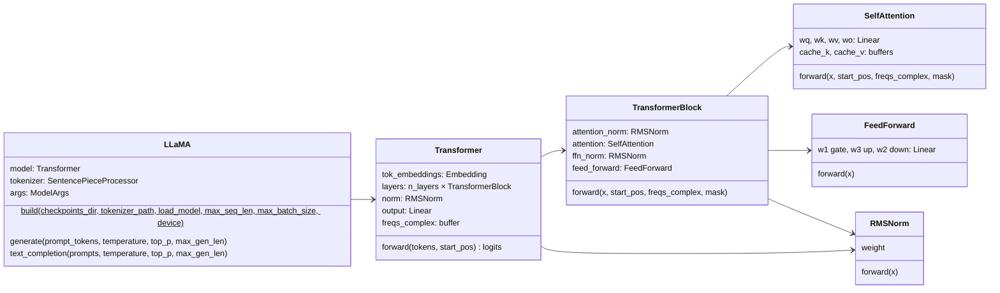
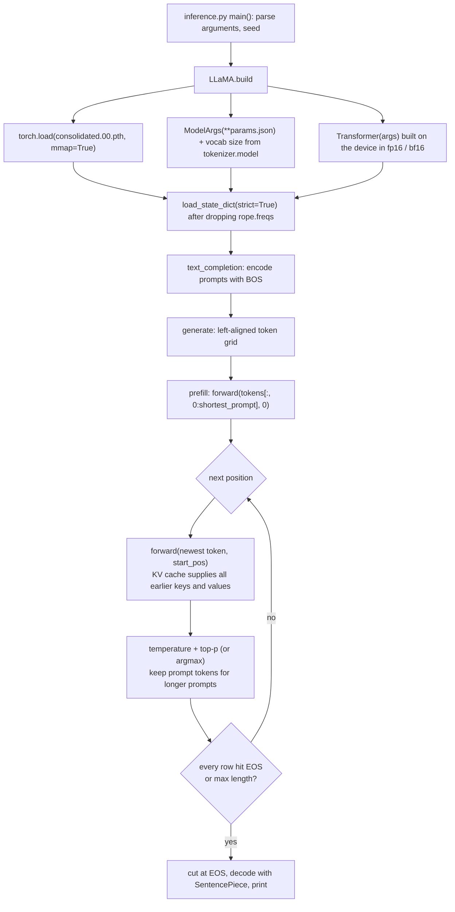

# Llama 2 from Scratch

A from-scratch PyTorch implementation of the Llama 2 architecture that loads Meta's original weights and generates text. The whole model is in one file ([`model.py`](model.py), about 280 lines), and text generation with top-p sampling is in another ([`inference.py`](inference.py)).

- **How the model works**, following the papers (RMSNorm, rotary embeddings, grouped-query attention, KV cache, SwiGLU, top-p sampling): see **[REPORT.md](REPORT.md)**.
- **How to use the code and how it is organised**: this file.

This project is inference-only: it runs Meta's pretrained weights and contains no training code.

## Contents

- [Quick start](#quick-start)
- [Setup](#setup)
- [Getting the Llama 2 weights](#getting-the-llama-2-weights)
- [Generating text](#generating-text)
- [Using it from Python](#using-it-from-python)
- [Running the tests](#running-the-tests)
- [Code architecture](#code-architecture)

## Quick start

```bash
cd llama2-from-scratch
pip install -r requirements.txt
python -m pytest -q tests                     # 16 tests on a tiny random model, no weights needed
python inference.py --prompt "The capital of Indonesia is"   # needs the weights, see below
```

## Setup

Requirements: Python 3.10+ and the packages in [`requirements.txt`](requirements.txt): `torch`, `sentencepiece`, `tqdm` and `pytest`.

```bash
conda create -n llama2 python=3.11
conda activate llama2
pip install -r requirements.txt
```

For GPU inference, install a CUDA build of PyTorch first, following the selector on [pytorch.org](https://pytorch.org/get-started/locally/).

**Hardware for the 7B model.** The weights alone are 13.5 GB in fp16. On a GPU you need roughly 14–16 GB of memory: the weights plus the KV cache, which takes 0.5 MiB per token of `max_batch_size × max_seq_len` (2 prompts × 1024 tokens ≈ 1 GiB). On a CPU the model runs in bfloat16 and needs about 14 GB of free RAM, and it is much slower than on a GPU.

## Getting the Llama 2 weights

The weights are gated: you must accept Meta's license first. Two ways to get the **original (Meta) format**, which this code expects:

1. Request access at [llama.meta.com](https://llama.meta.com/llama-downloads/) and run the `download.sh` script from the [meta-llama/llama](https://github.com/meta-llama/llama) repository with the URL you receive by email. Choose the `7B` model.
2. Or request access to [meta-llama/Llama-2-7b](https://huggingface.co/meta-llama/Llama-2-7b) on Hugging Face and download its files. Use this repository, **not** `Llama-2-7b-hf`: the `-hf` version uses a different file format and a different layout of the query/key weights.

Place the files like this (these are the defaults of `inference.py`):

```text
llama2-from-scratch/
├── llama-2-7b/
│   ├── consolidated.00.pth      # weights, ~13.5 GB
│   ├── params.json              # model shapes
│   └── checklist.chk
├── tokenizer.model              # SentencePiece tokenizer, shared by all sizes
├── model.py
└── inference.py
```

The [`.gitignore`](.gitignore) keeps `llama-2-*/`, `*.pth` and `tokenizer.model` out of git. Never commit the weights.

Only **single-file** checkpoints are supported, which means 7B. Meta splits 13B and 70B into 2 and 8 files for model-parallel loading, which this code does not implement. The 7B **chat** model (`llama-2-7b-chat`) loads the same way, but this code does not build the `[INST] … [/INST]` chat prompt format; pass the formatted text yourself.

## Generating text

```bash
# Two default prompts from Meta's example, sampled with temperature 0.6 and top-p 0.9
python inference.py

# Your own prompts (repeat --prompt to run a batch)
python inference.py --prompt "Simply put, the theory of relativity states that " --prompt "A haiku about GPUs:"

# Deterministic greedy decoding
python inference.py --prompt "The three primary colors are" --temperature 0

# Other locations, longer outputs, CPU
python inference.py --ckpt-dir D:/models/llama-2-7b --tokenizer D:/models/tokenizer.model --max-gen-len 200 --device cpu
```

| Option | Default | Meaning |
|---|---|---|
| `--ckpt-dir` | `llama-2-7b` | Folder with `consolidated.00.pth` and `params.json` |
| `--tokenizer` | `tokenizer.model` | Meta's SentencePiece model |
| `--prompt` | two example prompts | Prompt to complete; repeat the flag for a batch |
| `--max-seq-len` | 1024 | Context length to allocate for the KV cache (prompt + generated tokens; Llama 2 supports up to 4096) |
| `--max-gen-len` | 64 | Maximum number of new tokens per prompt |
| `--temperature` | 0.6 | Sampling temperature; `0` means greedy (argmax) |
| `--top-p` | 0.9 | Nucleus sampling threshold |
| `--device` | `cuda` if available, else `cpu` | Where to run; the model uses fp16 on CUDA and bf16 on CPU |
| `--seed` | 1 | Random seed for sampling |

The output prints each prompt followed by its completion. Generation stops at the end-of-sequence token or after `--max-gen-len` tokens.

## Using it from Python

```python
import torch
from inference import LLaMA

torch.manual_seed(1)
llama = LLaMA.build(
    checkpoints_dir="llama-2-7b",
    tokenizer_path="tokenizer.model",
    load_model=True,
    max_seq_len=512,
    max_batch_size=2,
    device="cuda",
)

tokens, texts = llama.text_completion(
    ["The Transformer architecture is", "Grouped-query attention reduces"],
    temperature=0.6, top_p=0.9, max_gen_len=50,
)
print(texts[0])

# Lower level: token ids in, token ids out
prompt_ids = [llama.tokenizer.encode("Hello", add_bos=True)]
completion_ids = llama.generate(prompt_ids, temperature=0, max_gen_len=20)

# Lowest level: logits for every position (the model is inference-only)
logits = llama.model(torch.tensor(prompt_ids, device="cuda"), start_pos=0)   # (1, L, 32000)
```

`load_model=False` builds a randomly initialised model with the shapes from `params.json`, without reading the weights file. This is useful for checking memory use or for experiments.

## Running the tests

The tests need **no weights**. They build tiny random models (a width of 32 and 2 layers) and train a 64-token SentencePiece tokenizer on the fly, and they run on CPU in about 2 seconds:

```bash
python -m pytest -q tests
# On Windows, if pytest warns that it cannot create .pytest_cache:
python -m pytest -q -p no:cacheprovider tests
```

| File | What it checks |
|---|---|
| [`tests/test_model.py`](tests/test_model.py) | Logit shapes; **KV-cache decoding (prefill + one token at a time) equals a full forward pass**; the causal mask; the RoPE $\theta_i$ formula, norm preservation and the relative-position property; `repeat_kv`; the RMSNorm formula; GQA projection shapes; SwiGLU hidden sizes of the real 7B (11008) and 70B (28672); state_dict keys equal Meta's checkpoint keys; `ModelArgs(**params.json)` |
| [`tests/test_inference.py`](tests/test_inference.py) | Top-p keeps only the nucleus; **batched greedy generation with prompts of different lengths equals a naive no-cache decoder**; `text_completion` output bounds; `LLaMA.build` loads a Meta-style folder (with the extra `rope.freqs` tensor) into bf16 weights |

## Code architecture

### Files

| File | Contents |
|---|---|
| [`model.py`](model.py) | The network: `ModelArgs`, RoPE helpers, `RMSNorm`, `repeat_kv`, `SelfAttention` (with KV cache), `FeedForward` (SwiGLU), `TransformerBlock`, `Transformer` |
| [`inference.py`](inference.py) | `sample_top_p`, the `LLaMA` wrapper (`build`, `generate`, `text_completion`) and the command-line tool |
| [`tests/`](tests) | pytest suite; `conftest.py` makes the modules importable and provides the tiny tokenizer |
| [`REPORT.md`](REPORT.md) | How each component works, with the maths and paper references |
| [`requirements.txt`](requirements.txt) | Python dependencies |

### Module structure



Helper functions in `model.py`: `precompute_theta_pos_frequencies` (the RoPE table, built once), `apply_rotary_embeddings` (rotates Q and K) and `repeat_kv` (shares KV heads across query heads for GQA). Helper in `inference.py`: `sample_top_p`.

Attribute names deliberately match Meta's (`tok_embeddings`, `layers.N.attention.wq`, `feed_forward.w1`, `attention_norm`, …). Checkpoint keys therefore map one-to-one onto the modules, and the weights load with `strict=True`.

### What happens when you run `inference.py`



### Shapes through one forward call

`Transformer.forward(tokens, start_pos)` takes `tokens` of shape `(B, Seq_Len)`. `Seq_Len` is the prompt length during prefill and 1 afterwards. `start_pos` is the absolute position of the first token in this call.

| Step | Shape (7B) |
|---|---|
| `tok_embeddings(tokens)` | `(B, Seq_Len, 4096)` |
| `wq(x)` → split heads, RoPE | `(B, Seq_Len, 32, 128)` |
| `wk(x)`, `wv(x)` → split heads (RoPE on K only) | `(B, Seq_Len, n_kv_heads, 128)` |
| write into `cache_k` / `cache_v` at `start_pos`, read `[0, start_pos + Seq_Len)` | `(B, start_pos + Seq_Len, n_kv_heads, 128)` |
| `repeat_kv`, attention scores (+ causal mask if `Seq_Len > 1`) | `(B, 32, Seq_Len, start_pos + Seq_Len)` |
| attention output → `wo` | `(B, Seq_Len, 4096)` |
| SwiGLU `w1`/`w3` → `w2` | `(B, Seq_Len, 11008)` → `(B, Seq_Len, 4096)` |
| after 32 blocks: `norm`, `output` | logits `(B, Seq_Len, 32000)`, float32 |

### Design notes

- **KV cache as buffers.** `cache_k`, `cache_v` and `freqs_complex` are registered with `persistent=False`. They move with `model.to(device)` and change dtype with `.half()`, but they are not saved in the state_dict, so Meta's checkpoints load cleanly. The cache is allocated for `max_batch_size × max_seq_len` when the model is built; choose both as small as your use allows.
- **Inference only.** `Transformer.forward` runs under `@torch.inference_mode()` and the cache is overwritten in place, so this model cannot be trained as-is.
- **Batching.** Prompts of different lengths share one batch. Positions are filled left-aligned, and rows with longer prompts keep their prompt tokens until generation reaches them. See [REPORT.md §12](REPORT.md#12-generating-text-temperature-top-p-and-the-generation-loop).

For the differences from Meta's reference implementation, see [REPORT.md §13](REPORT.md#13-scope-and-differences-from-metas-code).
