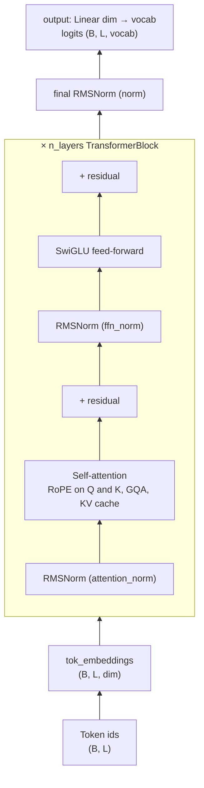
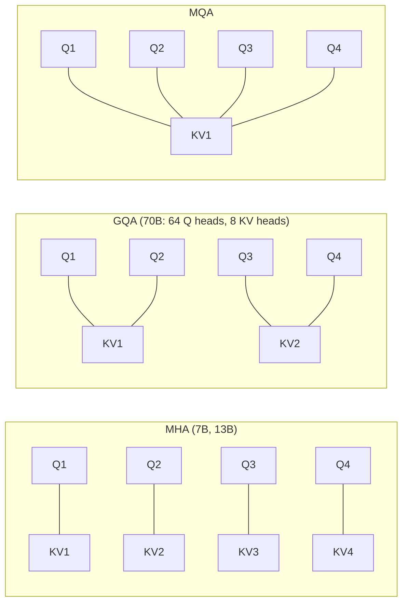
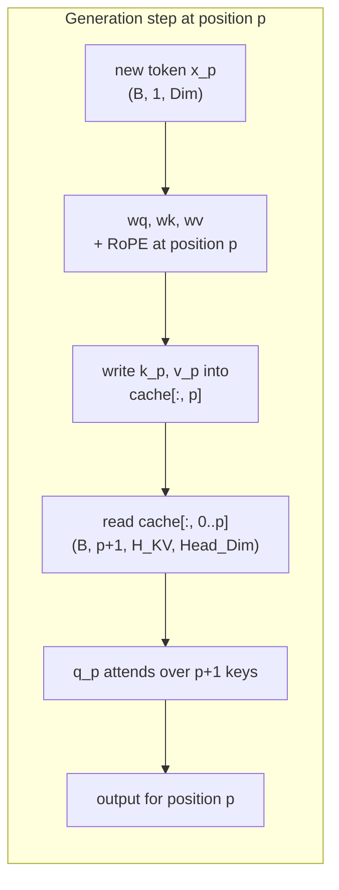
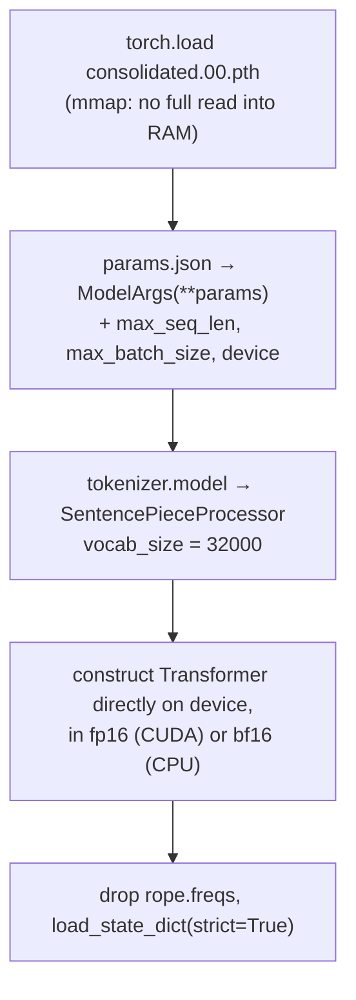
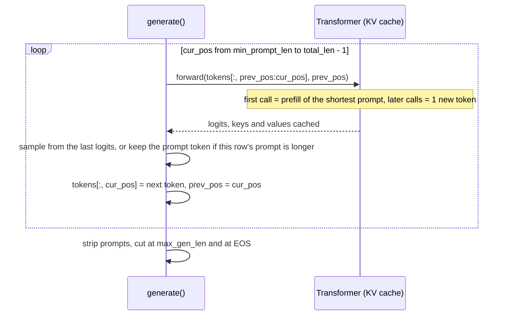

# How Llama 2 Works: a walkthrough of the architecture and inference code

This report explains how Llama 2 works, component by component, using the code in this folder ([`model.py`](model.py), [`inference.py`](inference.py)) as the running example. Each idea is presented in three parts: what the papers say, the maths, and the code that implements it. It builds on the [Transformer report](../transformers/REPORT.md); §1 lists what changed between the two models.

**Sources.** Llama 2 itself is described in one paper, but most of its parts come from earlier papers:

| Short name | Paper |
|---|---|
| **[Llama 2]** | Touvron et al. (2023), *Llama 2: Open Foundation and Fine-Tuned Chat Models*, [arXiv:2307.09288](https://arxiv.org/abs/2307.09288) |
| **[Llama 1]** | Touvron et al. (2023), *LLaMA: Open and Efficient Foundation Language Models*, [arXiv:2302.13971](https://arxiv.org/abs/2302.13971) |
| **[RMSNorm]** | Zhang & Sennrich (2019), *Root Mean Square Layer Normalization*, [arXiv:1910.07467](https://arxiv.org/abs/1910.07467) |
| **[SwiGLU]** | Shazeer (2020), *GLU Variants Improve Transformer*, [arXiv:2002.05202](https://arxiv.org/abs/2002.05202) |
| **[RoPE]** | Su et al. (2021), *RoFormer: Enhanced Transformer with Rotary Position Embedding*, [arXiv:2104.09864](https://arxiv.org/abs/2104.09864) |
| **[GQA]** | Ainslie et al. (2023), *GQA: Training Generalized Multi-Query Transformer Models from Multi-Head Checkpoints*, [arXiv:2305.13245](https://arxiv.org/abs/2305.13245) |
| **[Meta code]** | Meta's reference implementation, [github.com/meta-llama/llama](https://github.com/meta-llama/llama) (`llama/model.py`, `llama/generation.py`) |

The [Llama 2] paper describes the architecture in one sentence (§2.2):

> "We use the standard transformer architecture (Vaswani et al., 2017), apply pre-normalization using RMSNorm (Zhang and Sennrich, 2019), use the SwiGLU activation function (Shazeer, 2020), and rotary positional embeddings (RoPE, Su et al. 2022). The primary architectural differences from Llama 1 include increased context length and grouped-query attention (GQA)."

The rest of this report unpacks that sentence. For how to install and run the code, see [README.md](README.md).

## Contents

1. [From the 2017 Transformer to Llama 2](#1-from-the-2017-transformer-to-llama-2)
2. [The big picture: a decoder-only language model](#2-the-big-picture-a-decoder-only-language-model)
3. [Model sizes and shapes](#3-model-sizes-and-shapes)
4. [Tokenizer](#4-tokenizer)
5. [RMSNorm and pre-normalization](#5-rmsnorm-and-pre-normalization)
6. [Rotary positional embeddings (RoPE)](#6-rotary-positional-embeddings-rope)
7. [Self-attention with grouped-query attention (GQA)](#7-self-attention-with-grouped-query-attention-gqa)
8. [The KV cache](#8-the-kv-cache)
9. [SwiGLU feed-forward network](#9-swiglu-feed-forward-network)
10. [Putting the block and the model together](#10-putting-the-block-and-the-model-together)
11. [Loading Meta's weights](#11-loading-metas-weights)
12. [Generating text: temperature, top-p and the generation loop](#12-generating-text-temperature-top-p-and-the-generation-loop)
13. [Scope and differences from Meta's code](#13-scope-and-differences-from-metas-code)
14. [References](#14-references)

---

## 1. From the 2017 Transformer to Llama 2

Llama 2 is still a Transformer, but nearly every component has been swapped for a newer variant. This table maps each change to the section of the [Transformer report](../transformers/REPORT.md) that describes the original.

| Component | 2017 Transformer ([report](../transformers/REPORT.md)) | Llama 2 | Section here |
|---|---|---|---|
| Overall layout | Encoder–decoder for translation ([§10](../transformers/REPORT.md#10-the-encoder-and-decoder-stacks-31)) | **Decoder-only** language model: no encoder, no cross-attention | [§2](#2-the-big-picture-a-decoder-only-language-model) |
| Normalization | Post-LN LayerNorm in the paper (pre-LN in our code) ([§9](../transformers/REPORT.md#9-residual-connections-and-layer-normalization-31)) | **Pre-normalization with RMSNorm** (no mean subtraction, no bias) | [§5](#5-rmsnorm-and-pre-normalization) |
| Position information | Sinusoidal encoding **added once** to the input ([§4](../transformers/REPORT.md#4-positional-encoding-35)) | **RoPE**: queries and keys are **rotated** in every layer | [§6](#6-rotary-positional-embeddings-rope) |
| Attention heads | Multi-head attention, every head has its own K and V ([§6](../transformers/REPORT.md#6-multi-head-attention-322)) | Multi-head for 7B/13B; **grouped-query** (8 KV heads) for 34B/70B | [§7](#7-self-attention-with-grouped-query-attention-gqa) |
| Feed-forward | ReLU, $d_{ff} = 4d$ ([§8](../transformers/REPORT.md#8-position-wise-feed-forward-network-33-eq-2)) | **SwiGLU** with three matrices, $d_{ff} \approx \frac{2}{3} \cdot 4d$ | [§9](#9-swiglu-feed-forward-network) |
| Biases | In every linear layer and LayerNorm | **None** | — |
| Embedding ↔ output weights | Shared ([§11](../transformers/REPORT.md#11-output-projection-softmax-and-weight-sharing-34)) | **Not shared** | [§10](#10-putting-the-block-and-the-model-together) |
| Decoding | Greedy, recomputing the whole prefix every step ([§13](../transformers/REPORT.md#13-inference-generating-a-translation)) | **KV cache** + temperature + **top-p sampling** | [§8](#8-the-kv-cache), [§12](#12-generating-text-temperature-top-p-and-the-generation-loop) |
| Tokenizer | Word-level, one per language (our code) | SentencePiece BPE, 32k, shared by all text | [§4](#4-tokenizer) |

## 2. The big picture: a decoder-only language model

A translation model has an input sentence to read; a language model does not. Llama 2 is trained on one objective: given the tokens so far, **predict the next token**. That only needs the Transformer's *decoder* side, minus cross-attention, since there is no encoder to attend to. Translating, answering questions and writing code all become "continue this text".

[Llama 2] pre-trained the models on **2 trillion tokens** with a **4096-token context** (doubled from Llama 1's 2048). The training setup (AdamW with $\beta = (0.9, 0.95)$, cosine schedule with 2000 warm-up steps, weight decay 0.1, gradient clipping 1.0) is described in §2.2 of the paper. **This repo only runs inference** with Meta's released weights; it contains no training code.



The causal mask from the 2017 decoder is still there, so token $i$ can only see tokens $\le i$. Without an encoder, there is only one kind of attention left: masked self-attention.

## 3. Model sizes and shapes

The released Llama 2 sizes ([Llama 2] Table 1, plus the published configs):

| | 7B | 13B | 70B |
|---|---|---|---|
| `dim` (model width) | 4096 | 5120 | 8192 |
| `n_layers` | 32 | 40 | 80 |
| `n_heads` (query heads) | 32 | 40 | 64 |
| `n_kv_heads` | 32 (= MHA) | 40 (= MHA) | **8 (GQA)** |
| head dimension (`dim / n_heads`) | 128 | 128 | 128 |
| FFN hidden size | 11008 | 13824 | 28672 |
| vocabulary | 32000 | 32000 | 32000 |
| context length | 4096 | 4096 | 4096 |
| `norm_eps` | 1e-5 | 1e-5 | 1e-5 |

(A 34B model with GQA is described in the paper but was not released.)

The defaults in [`ModelArgs`](model.py#L9) are the 7B shapes. With them, [`Transformer`](model.py#L231) has **6,738,415,616 parameters**: 131M in the input embedding, 131M in the output layer, and 202M in each of the 32 blocks (67M attention + 135M feed-forward). Two thirds of every block is the feed-forward network.

In the code comments, `B` is the batch size, `Seq_Len` the number of tokens fed in this call, `Dim` the model width, `H_Q`/`H_KV` the number of query/key-value heads and `Head_Dim` the per-head width.

## 4. Tokenizer

From [Llama 2] §2.2: "We use the same tokenizer as Llama 1; it employs a bytepair encoding (BPE) algorithm … using the implementation from SentencePiece … we split all numbers into individual digits and use bytes to decompose unknown UTF-8 characters. The total vocabulary size is 32k tokens."

- **BPE** starts from characters and repeatedly merges the most frequent adjacent pair, so common words become one token and rare words are spelled out from pieces. Nothing is ever out of vocabulary, unlike the word-level tokenizers in the transformers project.
- **Digits are split** (`2023` → `2 0 2 3`), which makes arithmetic more regular.
- **Byte fallback**: any character not in the vocabulary is encoded as its UTF-8 bytes.
- Special ids: `<unk>` = 0, `<s>` (BOS, beginning of sequence) = 1, `</s>` (EOS) = 2. There is **no padding token**: `pad_id()` returns −1, which [§12](#12-generating-text-temperature-top-p-and-the-generation-loop) takes advantage of.

[`text_completion`](inference.py#L148) encodes each prompt with BOS prepended, as in pre-training:

```python
prompt_tokens = [self.tokenizer.encode(prompt, out_type=int, add_bos=True, add_eos=False) for prompt in prompts]
```

## 5. RMSNorm and pre-normalization

**Pre-normalization.** [Llama 1] §2.2: "To improve the training stability, we normalize the input of each transformer sub-layer, instead of normalizing the output." This is the Pre-LN arrangement discussed in [§9 of the Transformer report](../transformers/REPORT.md#9-residual-connections-and-layer-normalization-31), which trains stably without depending on warm-up.

**RMSNorm.** LayerNorm does two things: it *re-centers* (subtracts the mean) and *re-scales* (divides by the standard deviation). [RMSNorm] hypothesises "that the re-scaling invariance is the reason for success of LayerNorm, rather than re-centering invariance", and drops the re-centering:

$$
\operatorname{RMSNorm}(a)_i = \frac{a_i}{\operatorname{RMS}(a)}\, g_i,
\qquad
\operatorname{RMS}(a) = \sqrt{\frac{1}{n}\sum_{j=1}^{n} a_j^2 + \epsilon}
$$

The learned gain $g$ (`weight`, initialised to 1) is the only parameter; there is no bias. Skipping the mean makes it slightly cheaper, and it works as well in practice. Llama uses $\epsilon = 10^{-5}$ (`norm_eps`).

```python
# model.py — RMSNorm
def _norm(self, x):
    # x * 1/sqrt(mean(x^2) + eps), computed per token over the last dimension
    return x * torch.rsqrt(x.pow(2).mean(-1, keepdim=True) + self.eps)

def forward(self, x):
    return self.weight * self._norm(x.float()).type_as(x)
```

The normalization is computed in float32 even when the model runs in float16 (`x.float()`, then back with `type_as`). Squaring fp16 values can overflow, and the mean of many small squares loses precision.

Code: [`RMSNorm`](model.py#L63). Each block has two (`attention_norm`, `ffn_norm`), and one more (`norm`) follows the last block.

## 6. Rotary positional embeddings (RoPE)

### The goal

Attention scores are dot products $q_m \cdot k_n$ between a query at position $m$ and a key at position $n$. What usually matters is the **relative** distance $m - n$ ("the word two positions back"), not the absolute positions. [RoPE] (§3.1) looks for a way to encode position such that

$$
\langle f_q(x_m, m),\, f_k(x_n, n) \rangle = g(x_m, x_n, m - n),
$$

that is, the score depends on the two tokens' contents and **only** on their offset.

The 2017 sinusoidal encoding is *added* to the embeddings once, at the bottom of the network. After 32 layers of mixing, nothing guarantees that the attention scores still depend on position in a clean, relative way.

### The idea: rotate

Take a 2-dimensional query $q = (q_1, q_2)$ and view it as the complex number $q_1 + i q_2$. Multiplying by $e^{i m \theta}$ **rotates** it by the angle $m\theta$ without changing its length. Do the same to the key at position $n$. For 2D vectors, the dot product equals the real part of one complex number times the conjugate of the other, so

$$
\langle q e^{i m\theta},\; k e^{i n\theta} \rangle
= \operatorname{Re}\!\left[ q e^{i m\theta}\; \overline{k e^{i n\theta}} \right]
= \operatorname{Re}\!\left[ q \bar{k}\; e^{i (m-n)\theta} \right].
$$

The absolute positions cancel and only $m - n$ remains ([RoPE] Eq. 12 and Eq. 16). Geometrically, if you rotate both arrows, the angle *between* them only changes by the difference of the rotations.

### Many frequencies

A head vector has $d = 128$ dimensions, not 2. RoPE splits it into $d/2 = 64$ **pairs of adjacent dimensions** $(x_1, x_2), (x_3, x_4), \dots$ and rotates pair $i$ at its own speed $\theta_i$ ([RoPE] Eq. 15):

$$
\Theta = \left\{\, \theta_i = 10000^{-2(i-1)/d},\;\; i = 1, 2, \dots, d/2 \,\right\}
$$

These are the same frequencies as the 2017 sinusoidal encoding. Pair 1 rotates by 1 radian per position; pair 64 rotates very slowly. Fast pairs distinguish neighbouring positions, slow pairs track long distances. As a matrix, the rotation is block-diagonal with one $2\times2$ rotation per pair:

$$
R_{\Theta, m} =
\begin{pmatrix}
\cos m\theta_1 & -\sin m\theta_1 & & \\
\sin m\theta_1 & \cos m\theta_1 & & \\
& & \ddots & \\
& & & \cos m\theta_{d/2} & -\sin m\theta_{d/2} \\
& & & \sin m\theta_{d/2} & \cos m\theta_{d/2}
\end{pmatrix},
\qquad
q_m^\top k_n = (R_m W_q x_m)^\top (R_n W_k x_n) = x_m^\top W_q^\top R_{n-m} W_k x_n
$$

Rotations are orthogonal, so RoPE never changes vector lengths.

Two details matter in practice:

- RoPE is applied to **queries and keys only, never values**. Values carry content; position only needs to affect *where* attention looks.
- It is applied **in every layer**, right after the Q/K projections, rather than once at the input.

### Implementation with complex numbers

[`precompute_theta_pos_frequencies`](model.py#L27) builds a table of $e^{i m \theta_i}$ for every position $m$ and frequency $i$, once:

```python
theta_numerator = torch.arange(0, head_dim, 2).float()          # 2(i-1) = 0, 2, 4, ..., d-2
theta = 1.0 / (theta ** (theta_numerator / head_dim))           # θ_i, shape (d/2,)
m = torch.arange(seq_len)                                       # positions
freqs = torch.outer(m, theta).float()                           # m·θ_i, shape (seq_len, d/2)
freqs_complex = torch.polar(torch.ones_like(freqs), freqs)      # e^{i m θ_i} = cos + i·sin
```

[`apply_rotary_embeddings`](model.py#L48) treats each adjacent pair of a head vector as one complex number and multiplies, which performs all 64 rotations at once:

```python
x_complex = torch.view_as_complex(x.float().reshape(*x.shape[:-1], -1, 2))   # (B, L, H, d/2) complex
x_rotated = x_complex * freqs_complex.unsqueeze(0).unsqueeze(2)              # rotate pair i by m·θ_i
x_out = torch.view_as_real(x_rotated).reshape(*x.shape)                     # back to (B, L, H, d) real
```

$d$ here is the **head** dimension (128), not the model width (4096). The table covers `max_seq_len * 2` positions as in [Meta code], and each forward call slices out the rows for positions `start_pos … start_pos + Seq_Len`. That way tokens fed later in generation get the correct absolute rotation.

The tests in [`tests/test_model.py`](tests/test_model.py) check the formula for $\theta_i$, that rotation preserves vector norms, and that a score at positions (5, 2) equals the score at (15, 12).

## 7. Self-attention with grouped-query attention (GQA)

The attention computation itself is unchanged from 2017: $\operatorname{softmax}(QK^\top / \sqrt{d_{head}} + \text{mask})\,V$, per head, followed by an output projection `wo`. What changes is **how many key and value heads** there are.

- **Multi-head attention (MHA)**: every query head has its own key and value head. Used by Llama 2 7B and 13B.
- **Multi-query attention (MQA)**: all query heads share a single key/value head. Much less memory, but some loss of quality.
- **Grouped-query attention (GQA)**: in between. [GQA] §2.2: "Grouped-query attention divides query heads into G groups, each of which shares a single key head and value head." GQA-1 is MQA and GQA-H is MHA.



**Why bother?** During generation, the model must read every cached key and value at every step ([§8](#8-the-kv-cache)). That memory traffic, not arithmetic, is the bottleneck. [Llama 2] Table 1 notes that the "bigger models — 34B and 70B — use Grouped-Query Attention (GQA) for improved inference scalability", with 8 KV heads (Appendix A.2.1). For 70B, that shrinks the KV cache 8× (64 query heads share 8 KV heads). To keep the parameter count the same, the paper widens the FFN by a factor of 1.3 (`ffn_dim_multiplier`, [§9](#9-swiglu-feed-forward-network)).

**In code**, [`SelfAttention`](model.py#L93) projects to `n_heads` query heads but only `n_kv_heads` key/value heads. `n_kv_heads=None` means MHA:

```python
self.n_kv_heads = args.n_heads if args.n_kv_heads is None else args.n_kv_heads
self.n_rep = self.n_heads_q // self.n_kv_heads                     # query heads per KV head
self.wq = nn.Linear(args.dim, args.n_heads * self.head_dim, bias=False)
self.wk = nn.Linear(args.dim, self.n_kv_heads * self.head_dim, bias=False)
self.wv = nn.Linear(args.dim, self.n_kv_heads * self.head_dim, bias=False)
self.wo = nn.Linear(args.n_heads * self.head_dim, args.dim, bias=False)
```

Only the `n_kv_heads` heads are stored in the cache. Right before the matrix multiplication, [`repeat_kv`](model.py#L79) copies each KV head `n_rep` times, so query head $h$ uses KV head $\lfloor h / n_{rep} \rfloor$:

```python
x[:, :, :, None, :]                                          # (B, L, H_KV, 1, Head_Dim)
 .expand(batch_size, seq_len, n_kv_heads, n_rep, head_dim)   # (B, L, H_KV, N_Rep, Head_Dim), no copy yet
 .reshape(batch_size, seq_len, n_kv_heads * n_rep, head_dim) # (B, L, H_Q, Head_Dim)
```

## 8. The KV cache

### Why

A language model generates one token at a time. The naive approach, used by the greedy decoder in the [Transformer project](../transformers/REPORT.md#13-inference-generating-a-translation), feeds the whole sequence through the model again at every step. But because of the causal mask, the keys and values of earlier tokens **never change** once computed: token 5 cannot see token 6, so adding token 6 does not affect anything computed for tokens 1–5. We can compute each token's keys and values **once**, store them, and at each new step compute Q, K and V only for the newest token.



### In code

Each [`SelfAttention`](model.py#L93) owns two buffers of shape `(max_batch_size, max_seq_len, n_kv_heads, head_dim)`. They are registered as **non-persistent buffers**, so they follow the model to the GPU and to fp16, but are not saved in checkpoints. [`forward`](model.py#L116) writes the new keys and values at `start_pos` and attends over everything up to the current position:

```python
self.cache_k[:batch_size, start_pos : start_pos + seq_len] = xk    # xk already rotated by RoPE
self.cache_v[:batch_size, start_pos : start_pos + seq_len] = xv
keys   = self.cache_k[:batch_size, :start_pos + seq_len]           # (B, Seq_Len_KV, H_KV, Head_Dim)
values = self.cache_v[:batch_size, :start_pos + seq_len]
```

Keys are cached **after** RoPE, because the rotation for a position never changes.

### Prefill and the causal mask

The prompt is known up front, so it is fed in **one** call (the *prefill*); generated tokens are then fed one per call. In the prefill call (`Seq_Len > 1`), new tokens must not see later new tokens, so [`Transformer.forward`](model.py#L256) builds a causal mask. Its shape is `(Seq_Len, start_pos + Seq_Len)`: every cached column is visible, and the new block is lower-triangular. For `start_pos = 2` and `Seq_Len = 3` (0 = visible, −∞ = hidden):

| new token \ key position | 0 (cached) | 1 (cached) | 2 | 3 | 4 |
|---|---|---|---|---|---|
| position 2 | 0 | 0 | 0 | −∞ | −∞ |
| position 3 | 0 | 0 | 0 | 0 | −∞ |
| position 4 | 0 | 0 | 0 | 0 | 0 |

```python
mask = torch.full((seq_len, seq_len), float("-inf"))
mask = torch.triu(mask, diagonal=1)                                   # −∞ above the diagonal
mask = torch.hstack([torch.zeros((seq_len, start_pos)), mask])        # cached positions are always visible
```

With a single new token (`Seq_Len = 1`) no mask is needed: the newest token may look at everything.

The test `test_kv_cache_incremental_decoding_matches_full_forward` checks that prefill plus one-token-at-a-time decoding gives the same logits as a single full forward pass.

### What it costs

The cache holds 2 (K and V) × layers × KV heads × head dim numbers per token. For 7B in fp16: $2 \times 32 \times 32 \times 128 \times 2$ bytes = **0.5 MiB per token**, so **2 GiB** for one full 4096-token sequence. For 70B with GQA: $2 \times 80 \times 8 \times 128 \times 2$ bytes = 0.31 MiB per token. Without GQA it would be 2.5 MiB, 8× more. That is the saving that motivates [§7](#7-self-attention-with-grouped-query-attention-gqa).

Because the cache is allocated for `max_batch_size × max_seq_len` up front, choose these at load time only as large as you need ([`LLaMA.build`](inference.py#L42)).

## 9. SwiGLU feed-forward network

[Llama 1] §2.2: "We replace the ReLU non-linearity by the SwiGLU activation function, introduced by Shazeer (2020) to improve the performance. We use a dimension of $\frac{2}{3}4d$ instead of $4d$ as in PaLM."

**Gated linear units.** Instead of passing one projection through a nonlinearity, a GLU computes **two** projections and multiplies them element-wise, so one acts as a learned *gate* on the other. SwiGLU uses the Swish (SiLU) function, $\operatorname{Swish}(x) = x \cdot \sigma(x)$, as the gate's nonlinearity ([SwiGLU] Eq. 5–6):

$$
\operatorname{FFN}_{\text{SwiGLU}}(x) = \big(\operatorname{Swish}(xW_1) \otimes xW_3\big)\, W_2
$$

$W_1$ is the gate, $W_3$ the "up" projection and $W_2$ the "down" projection. These are the names `w1`, `w3`, `w2` in Meta's checkpoints.

```python
# model.py — FeedForward.forward
swish = F.silu(self.w1(x))      # (B, L, Dim) -> (B, L, Hidden_Dim)  gate
x_V = self.w3(x)                # (B, L, Dim) -> (B, L, Hidden_Dim)  up
x = swish * x_V                 # element-wise gating
x = self.w2(x)                  # (B, L, Hidden_Dim) -> (B, L, Dim)   down
```

**Why $\frac{2}{3} \cdot 4d$?** A ReLU FFN has two $d \times 4d$ matrices, $8d^2$ weights in total. SwiGLU has three matrices. To keep the same parameter count, $3 \cdot d \cdot d_{ff} = 8d^2$, so $d_{ff} = \frac{2}{3} \cdot 4d$. In [SwiGLU] §2's words, they "reduce the number of hidden units $d_{ff}$ … by a factor of $\frac{2}{3}$".

[`FeedForward.__init__`](model.py#L175) then rounds **up** to a multiple of `multiple_of`, which keeps the matrix sizes friendly to GPU kernels, and applies `ffn_dim_multiplier` if set (the 1.3 GQA compensation from §7):

| Model | $\lfloor \frac{2}{3} \cdot 4d \rfloor$ | × multiplier | round up to multiple of | hidden size |
|---|---|---|---|---|
| 7B ($d = 4096$) | 10922 | — | 256 | **11008** |
| 70B ($d = 8192$) | 21845 | 1.3 → 28398 | 4096 | **28672** |

Both values match the released checkpoints (checked in `test_swiglu_hidden_size_matches_released_models`).

## 10. Putting the block and the model together

Each [`TransformerBlock`](model.py#L205) is two pre-normalized residual sub-layers:

$$
h = x + \operatorname{Attention}(\operatorname{RMSNorm}(x)), \qquad
\text{out} = h + \operatorname{FFN}(\operatorname{RMSNorm}(h))
$$

```python
# model.py — TransformerBlock.forward
h = x + self.attention.forward(self.attention_norm(x), start_pos, freqs_complex, mask)
out = h + self.feed_forward.forward(self.ffn_norm(h))
```

There is no dropout (this is an inference implementation) and no bias anywhere.

[`Transformer.forward(tokens, start_pos)`](model.py#L256) runs the whole model:

1. Look up embeddings: `(B, Seq_Len)` → `(B, Seq_Len, Dim)`. Unlike 2017, there is no $\sqrt{d}$ scaling and no positional encoding at this point; position enters through RoPE inside attention.
2. Slice the RoPE table for positions `start_pos … start_pos + Seq_Len`.
3. Build the causal mask if `Seq_Len > 1` ([§8](#8-the-kv-cache)).
4. Run all `n_layers` blocks.
5. Apply the final RMSNorm, then the `output` linear layer → logits `(B, Seq_Len, vocab)`, returned in float32.

The input embedding (`tok_embeddings`) and the output layer (`output`) are **separate** matrices; Llama 2 does not tie them, unlike the 2017 Transformer. The method is decorated with `@torch.inference_mode()`, which turns off gradient tracking: this model is for generation only.

## 11. Loading Meta's weights

Meta distributes each model as a folder containing `params.json` (the shapes) and `consolidated.NN.pth` files (the weights), plus a shared `tokenizer.model`. For 7B there is one weight file, `consolidated.00.pth`. [`LLaMA.build`](inference.py#L42) loads them in the same order as [Meta code]'s `Llama.build`:



- **Matching names.** The `ModelArgs` fields have exactly the names of the `params.json` keys (`dim`, `n_layers`, `n_heads`, `n_kv_heads`, `multiple_of`, `ffn_dim_multiplier`, `norm_eps`, …), so `ModelArgs(**params)` works directly. The module attribute names (`tok_embeddings`, `layers.N.attention.wq`, `feed_forward.w1`, `attention_norm`, `ffn_norm`, `norm`, `output`) match the checkpoint keys. That is why the weights load with `strict=True`, which verifies that every tensor found its place.
- **`rope.freqs`.** The checkpoint contains one extra tensor, a precomputed RoPE table that the model rebuilds itself, so it is removed before loading.
- **Precision.** The weights are stored in fp16 (13.5 GB for 7B). Building the model in fp32 first would need 27 GB, so the code sets the default dtype to fp16 (bf16 on CPU, where fp16 matrix multiplications are poorly supported) and constructs the model directly on the target device.

Only single-file checkpoints are supported. 13B and 70B are split across 2 and 8 files for model-parallel loading, which this code does not implement.

## 12. Generating text: temperature, top-p and the generation loop

The model outputs **logits**, one score per vocabulary token, for the next position. Turning them into text is a separate algorithm, in [`LLaMA.generate`](inference.py#L89).

### Temperature

Dividing logits by a temperature $T$ before the softmax controls how adventurous sampling is:

$$
p_i = \frac{\exp(z_i / T)}{\sum_j \exp(z_j / T)}
$$

$T < 1$ sharpens the distribution towards the most likely token, $T > 1$ flattens it, and $T \to 0$ is greedy decoding (`argmax`; pass `--temperature 0`). Meta's default is $T = 0.6$.

### Top-p (nucleus) sampling

Even after temperature, the long tail of thousands of unlikely tokens adds up to a real chance of picking nonsense. **Top-p sampling** samples only from the smallest set of most-likely tokens whose total probability reaches $p$ (default 0.9), after renormalizing. [`sample_top_p`](inference.py#L15):

```python
probs_sort, probs_idx = torch.sort(probs, dim=-1, descending=True)
probs_sum = torch.cumsum(probs_sort, dim=-1)
mask = probs_sum - probs_sort > p      # mass of the tokens *before* this one already exceeds p
probs_sort[mask] = 0.0
probs_sort.div_(probs_sort.sum(dim=-1, keepdim=True))
next_token = torch.gather(probs_idx, -1, torch.multinomial(probs_sort, num_samples=1))
```

Example with $p = 0.7$ (the case checked by `test_sample_top_p_only_samples_from_the_nucleus`):

| token | probability | mass before it | kept? |
|---|---|---|---|
| A | 0.50 | 0.00 | yes |
| B | 0.30 | 0.50 | yes, it is the token that crosses 0.7 |
| C | 0.15 | 0.80 | no |
| D | 0.05 | 0.95 | no |

After renormalizing, A is sampled with probability 0.625 and B with 0.375. Subtracting `probs_sort` before comparing ensures the most likely token is always kept, even for $p = 0$.

### The generation loop

`generate` handles a **batch** of prompts of different lengths, as Meta's code does:

1. Create a `(B, total_len)` tensor filled with `pad_id` (−1) and copy each prompt in, **left-aligned**. `prompt_tokens_mask` marks which positions came from a prompt.
2. **Prefill**: feed positions `0 … min_prompt_len − 1` (the length of the shortest prompt) in one call.
3. Loop over `cur_pos` from `min_prompt_len` to `total_len − 1`:
   - Call `model.forward(tokens[:, prev_pos:cur_pos], prev_pos)`, which after the first call is a single new token, using the KV cache.
   - Pick the next token from the last position's logits (temperature + top-p, or argmax).
   - **If this position is still inside a longer prompt, keep the prompt token** and discard the prediction: `torch.where(prompt_tokens_mask[:, cur_pos], tokens[:, cur_pos], next_token)`.
   - A row is finished once it *generates* `</s>`; stop when every row is finished.
4. Return, for each row, only the generated part, cut at `max_gen_len` and at the first `</s>`.



The padding value −1 is never fed to the model: positions are only fed once they hold a real prompt token or a generated one. The test `test_greedy_batched_generation_matches_naive_decoding` checks that this batched, cached loop produces exactly the same tokens as a slow decoder that re-runs each prompt from scratch at every step.

## 13. Scope and differences from Meta's code

**Implemented:** the full Llama 2 architecture for any size (7B, 13B and 70B shapes, MHA and GQA), loading single-file Meta checkpoints, batched text completion with temperature and top-p, and greedy decoding.

**Not implemented:** training or fine-tuning; the chat format of Llama 2-Chat (`[INST] … [/INST]` with an optional `<<SYS>>` system prompt); model-parallel loading of multi-file checkpoints (13B, 70B); loading Hugging Face-format weights (Hugging Face reorders the `wq`/`wk` rows for a different RoPE layout).

**Small differences from [Meta code]**, none of which change the outputs:

| Here | Meta's code | Why |
|---|---|---|
| KV cache and RoPE table are non-persistent buffers | plain tensors moved to the device by hand | `.to(device)` / `.half()` move them automatically |
| `load_state_dict(strict=True)` after removing `rope.freqs` | `strict=False` | Fails loudly if any weight is missing or misnamed |
| Model built directly on the device with a temporary default dtype | `torch.set_default_tensor_type(torch.cuda.HalfTensor)` | Same effect without the deprecated API; also works on CPU (bf16) |
| `TransformerBlock`, `SelfAttention`, `freqs_complex` | `TransformerBlock`, `Attention`, `freqs_cis` | Naming only; checkpoint keys are identical |
| `ModelArgs.rope_theta` (default 10000) | not in Llama 2's `ModelArgs` | Accepts `params.json` files that set it; the default reproduces Llama 2 |

## 14. References

- Touvron et al. (2023). *Llama 2: Open Foundation and Fine-Tuned Chat Models.* [arXiv:2307.09288](https://arxiv.org/abs/2307.09288)
- Touvron et al. (2023). *LLaMA: Open and Efficient Foundation Language Models.* [arXiv:2302.13971](https://arxiv.org/abs/2302.13971)
- Zhang & Sennrich (2019). *Root Mean Square Layer Normalization.* [arXiv:1910.07467](https://arxiv.org/abs/1910.07467)
- Shazeer (2020). *GLU Variants Improve Transformer.* [arXiv:2002.05202](https://arxiv.org/abs/2002.05202)
- Su et al. (2021). *RoFormer: Enhanced Transformer with Rotary Position Embedding.* [arXiv:2104.09864](https://arxiv.org/abs/2104.09864)
- Ainslie et al. (2023). *GQA: Training Generalized Multi-Query Transformer Models from Multi-Head Checkpoints.* [arXiv:2305.13245](https://arxiv.org/abs/2305.13245)
- Holtzman et al. (2020). *The Curious Case of Neural Text Degeneration* (introduces nucleus / top-p sampling). [arXiv:1904.09751](https://arxiv.org/abs/1904.09751)
- Vaswani et al. (2017). *Attention Is All You Need.* [arXiv:1706.03762](https://arxiv.org/abs/1706.03762), explained in the [Transformer report](../transformers/REPORT.md).
- Meta's reference implementation: [github.com/meta-llama/llama](https://github.com/meta-llama/llama), `llama/model.py` and `llama/generation.py`.
