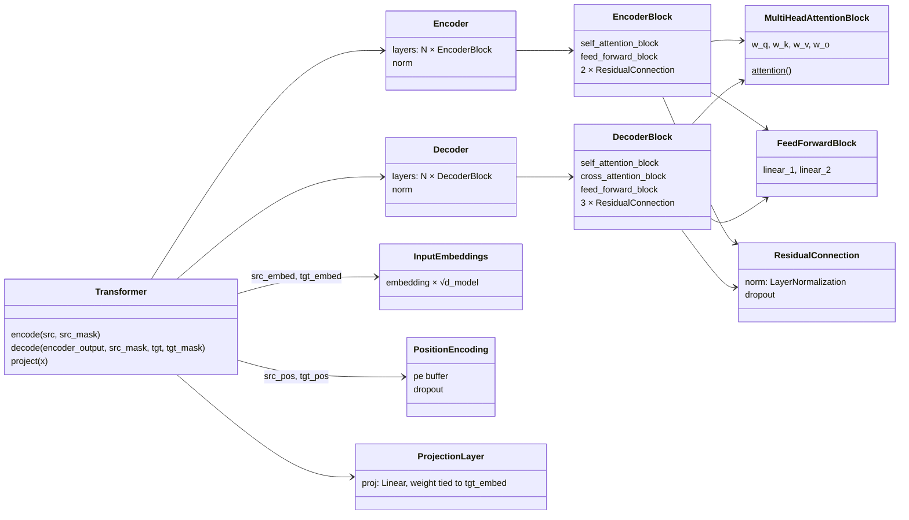

# Transformer from Scratch

A from-scratch PyTorch implementation of the original Transformer from *Attention Is All You Need* (Vaswani et al., 2017), trained for **English → Indonesian** translation on the [OPUS-100](https://huggingface.co/datasets/Helsinki-NLP/opus-100) corpus.

- **How the model works**, section by section with the paper's equations: see **[REPORT.md](REPORT.md)**.
- **How to use the code and how it is organised**: this file.

## Contents

- [Quick start](#quick-start)
- [Setup](#setup)
- [Training](#training)
- [Monitoring with TensorBoard](#monitoring-with-tensorboard)
- [Resuming training](#resuming-training)
- [Translating](#translating)
- [Running the tests](#running-the-tests)
- [Configuration](#configuration)
- [Code architecture](#code-architecture)

## Quick start

Run every command from inside this `transformers/` folder; the config uses paths relative to it.

```bash
cd transformers
pip install -r requirements.txt
python -m pytest -q tests                        # 18 tests, CPU, a few seconds
python train.py                                  # downloads OPUS-100 on first run, then trains
python translate.py "I like to eat fried rice."  # translate with the newest checkpoint
```

## Setup

The code was last run with Python 3.9, PyTorch 2.7.1 (CUDA 11.8), `tokenizers` 0.13.3 and `datasets` 2.15.0. [`requirements.txt`](requirements.txt) pins an older but compatible PyTorch (2.0.1) and also lists some packages the code does not import (`torchtext`, `torchmetrics`, `altair`, `wandb`).

```bash
conda create -n transformer python=3.9
conda activate transformer
pip install -r requirements.txt
python check_cuda.py          # prints whether PyTorch can see your GPU
```

For GPU training, install a CUDA build of PyTorch, following the selector on [pytorch.org](https://pytorch.org/get-started/locally/). Without a GPU everything still runs, just slowly.

## Training

```bash
python train.py
```

On the first run, [`train.py`](train.py):

1. Downloads `Helsinki-NLP/opus-100` (`en-id`, 1,000,000 training pairs) from the Hugging Face Hub and caches it in Arrow format in `./opus-100-fast-cache/`, so later runs load in seconds. [`process_data.py`](process_data.py) does the same download on its own if you want to fetch the data ahead of time.
2. Builds word-level tokenizers for each language (the 30,000 most frequent words each; any other word becomes `[UNK]`), unless `tokenizer_en.json` and `tokenizer_id.json` already exist. The repository includes both files.
3. Drops the pairs that do not fit in `seq_len` (exactly 1 pair with the default 350), then splits the rest 90% / 10% into training and validation sets.
4. Trains for `num_epochs` epochs. It uses Adam with the paper's warm-up learning-rate schedule, cross-entropy with label smoothing 0.1, and padding ignored in the loss.
5. After every epoch, it prints 2 validation translations (source, reference, prediction) and saves `weights/tmodel_<epoch>.pt`, which holds the model, the optimizer state and `global_step`.

**What to expect.** With the paper's schedule, the learning rate climbs for the first 4,000 steps, so early epochs mostly produce repeated or empty output. Useful translations need a long run. The paper trained 100,000 steps on batches of about 25,000 tokens, far more than this repo's default of 8 sentences per batch. No pretrained checkpoint is included.

**Making training faster.** The default `seq_len` is 350, but 99% of the sentence pairs are 38 tokens or shorter, so most of each batch is padding. Lowering `seq_len` (for example to 64) and raising `batch_size` makes training several times faster. The cost: a model trained with one `seq_len` cannot be resumed with another, because the positional-encoding table is saved at that size.

## Monitoring with TensorBoard

```bash
tensorboard --logdir runs
```

Logged under `runs/tmodel/`: `train loss` and `learning rate` per step, and the validation translations as text (`validation/example_1`, `validation/example_2`) per epoch. The `runs/` folder is gitignored.

## Resuming training

Set `preload` in [`config.py`](config.py) to the checkpoint's suffix. For example, `"preload": "05"` loads `weights/tmodel_05.pt`, and training continues from epoch 6 at the same point on the learning-rate schedule.

```python
# config.py
"preload": "05",
```

**About `weights/tmodel_interrupt.pt`** (local only, gitignored). This older checkpoint stopped after 107 training steps, so it produces empty or meaningless translations. It was trained before weight sharing was added, so to resume it you must set both `"preload": "interrupt"` and `"share_weights": False`. If the setting doesn't match the checkpoint, `train.py` stops with an error that says so. `translate.py` detects the setting automatically.

## Translating

```bash
python translate.py "Good morning, how are you?"                       # newest checkpoint in weights/
python translate.py "Good morning, how are you?" --checkpoint weights/tmodel_19.pt
```

```text
Checkpoint: weights/tmodel_19.pt
SOURCE:    Good morning, how are you?
PREDICTED: <the model's Indonesian translation>
```

[`translate.py`](translate.py) reads `seq_len`, `d_model` and whether the weights are shared from the checkpoint itself, so it loads both old and new checkpoints. Decoding is greedy: the model picks the most likely next word until it outputs `[EOS]`. The paper's beam search is not implemented.

From Python:

```python
import torch
from tokenizers import Tokenizer
from translate import load_model, translate_sentence

tokenizer_src = Tokenizer.from_file("tokenizer_en.json")
tokenizer_tgt = Tokenizer.from_file("tokenizer_id.json")
model, seq_len = load_model("weights/tmodel_19.pt", None, tokenizer_src, tokenizer_tgt, "cpu")
print(translate_sentence(model, "Thank you very much.", tokenizer_src, tokenizer_tgt, seq_len, "cpu"))
```

## Running the tests

```bash
python -m pytest -q tests
```

The tests use tiny models (width 16–32, 1–2 layers) and a 3-sentence toy corpus, so they need neither the dataset nor a GPU.

| File | What it checks |
|---|---|
| [`tests/test_model.py`](tests/test_model.py) | Output shapes of `encode` / `decode` / `project`; the causal mask hides future target tokens; the padding mask hides source padding |
| [`tests/test_dataset.py`](tests/test_dataset.py) | `[SOS] … [EOS] [PAD]` layout of encoder input, decoder input and label (shifted by one); mask shapes and contents; sentences that are too long are rejected |
| [`tests/test_training.py`](tests/test_training.py) | The Eq. 3 learning rate (linear warm-up, peak at step 4000, $1/\sqrt{step}$ decay); weight sharing creates one parameter that receives gradient from both uses; tied checkpoints are detected |
| [`tests/test_translate.py`](tests/test_translate.py) | Source encoding; greedy decoding starts with `[SOS]`, stops at `[EOS]` and respects the length limit; tied and untied checkpoints round-trip through `load_model`; the newest checkpoint is chosen |

## Configuration

All settings live in `get_config()` in [`config.py`](config.py):

| Key | Default | Meaning |
|---|---|---|
| `batch_size` | 8 | Sentence pairs per training batch |
| `num_epochs` | 20 | Epochs to train (counting from 0, or continuing from `preload`) |
| `warmup_steps` | 4000 | Linear warm-up length of the Eq. 3 learning-rate schedule |
| `lr_factor` | 1.0 | Multiplies the Eq. 3 learning rate (1.0 = paper; peak ≈ 7e-4) |
| `adam_betas`, `adam_eps` | (0.9, 0.98), 1e-9 | Adam settings from the paper (§5.3) |
| `seq_len` | 350 | Fixed padded length of every source and target sequence |
| `d_model` | 512 | Model width. Depth (6 layers), heads (8) and `d_ff` (2048) are the `build_transformer` defaults |
| `share_weights` | True | Tie the target embedding to the output projection (paper §3.4) |
| `lang_src`, `lang_tgt` | `en`, `id` | Language pair, also used in the dataset name (`en-id`) |
| `datasource`, `dataset_cache` | `Helsinki-NLP/opus-100`, `opus-100-fast-cache` | Hugging Face dataset and local cache folder |
| `model_folder`, `model_filename` | `weights`, `tmodel_` | Checkpoints are saved as `weights/tmodel_<epoch>.pt` |
| `preload` | None | Checkpoint suffix to resume from, e.g. `"05"` |
| `tokenizer_file` | `tokenizer_{0}.json` | Tokenizer path pattern; `{0}` becomes the language code |
| `experiment_name` | `runs/tmodel` | TensorBoard log folder |

## Code architecture

### Files

| File | Contents |
|---|---|
| [`model.py`](model.py) | The Transformer: `InputEmbeddings`, `PositionEncoding`, `LayerNormalization`, `FeedForwardBlock`, `MultiHeadAttentionBlock`, `ResidualConnection`, `EncoderBlock`/`Encoder`, `DecoderBlock`/`Decoder`, `ProjectionLayer`, `Transformer`, and the factory `build_transformer` |
| [`dataset.py`](dataset.py) | `BilingualDataset` (tokenize, add special tokens, pad, build masks) and `causal_mask` |
| [`train.py`](train.py) | Dataset download and caching, tokenizer building, the learning-rate schedule, the training loop, validation and checkpointing |
| [`translate.py`](translate.py) | `greedy_decode`, checkpoint loading and the command-line translator |
| [`config.py`](config.py) | Hyperparameters and paths |
| [`process_data.py`](process_data.py), [`check_cuda.py`](check_cuda.py) | Optional helpers: pre-download the dataset; check the GPU setup |
| `tokenizer_en.json`, `tokenizer_id.json` | Trained word-level tokenizers (special tokens `[UNK]`=0, `[PAD]`=1, `[SOS]`=2, `[EOS]`=3) |
| [`tests/`](tests) | pytest suite |

### Module structure

`build_transformer` creates every block and passes them into the containers that hold them:



### Data flow in training

```mermaid
flowchart LR
    hub["Hugging Face Hub<br/>opus-100 en-id"] -->|"first run"| cache["opus-100-fast-cache/"]
    cache --> getds["train.get_ds:<br/>tokenizers, drop too-long pairs,<br/>90/10 split, DataLoaders"]
    getds --> bd["BilingualDataset item:<br/>encoder_input, decoder_input, label (B, L)<br/>encoder_mask (B,1,1,L), decoder_mask (B,1,L,L)"]
    bd --> enc["model.encode → (B, L, 512)"]
    enc --> dec["model.decode → (B, L, 512)"]
    bd --> dec
    dec --> proj["model.project → logits (B, L, 30000)"]
    proj --> loss["CrossEntropyLoss vs label<br/>label smoothing 0.1, ignore [PAD]"]
    loss --> step["backward, set Eq. 3 lr, Adam step"]
    step --> ckpt["end of epoch: run_validation,<br/>save weights/tmodel_NN.pt"]
```



### One training example

For the pair "i eat rice" → "saya makan nasi" (see [REPORT.md §12](REPORT.md#12-training-5) for why the target is shifted):

| Tensor | Contents |
|---|---|
| `encoder_input` | `[SOS] i eat rice [EOS] [PAD] [PAD] …` |
| `decoder_input` | `[SOS] saya makan nasi [PAD] [PAD] …` |
| `label` | `saya makan nasi [EOS] [PAD] [PAD] …` |
| `encoder_mask` | 1 for the 5 real tokens, 0 for padding |
| `decoder_mask` | lower-triangular (causal) AND not padding |

### Checkpoint format

`weights/tmodel_<epoch>.pt` is a dictionary:

| Key | Contents |
|---|---|
| `epoch` | Last finished epoch |
| `global_step` | Optimizer steps so far; the learning rate is computed from it |
| `model_state_dict` | Model weights. With `share_weights=True`, the target embedding and the projection hold the same tensor |
| `optimizer_state_dict` | Adam moments, for resuming |

### Where it differs from the paper

The architecture follows the paper, with these changes (all explained in [REPORT.md §15](REPORT.md#15-where-this-implementation-differs-from-the-paper)): pre-norm instead of post-norm residual blocks, separate English and Indonesian word-level vocabularies (so only the target embedding is tied to the output layer), extra dropout on attention weights and inside the FFN, fixed padding to `seq_len`, and greedy decoding instead of beam search.
