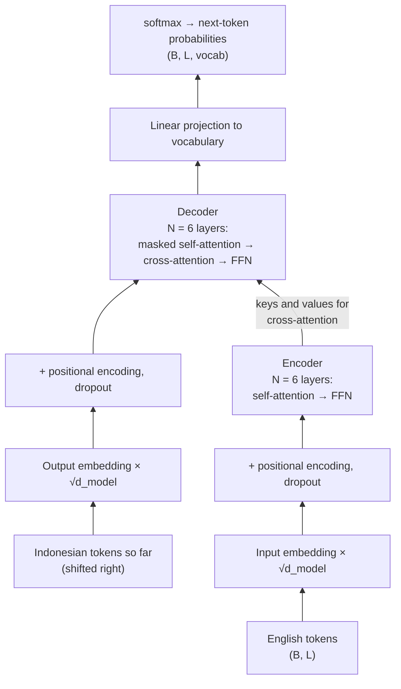
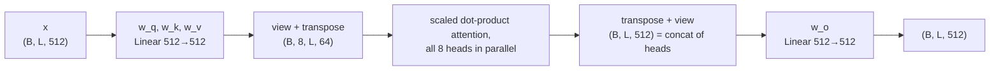
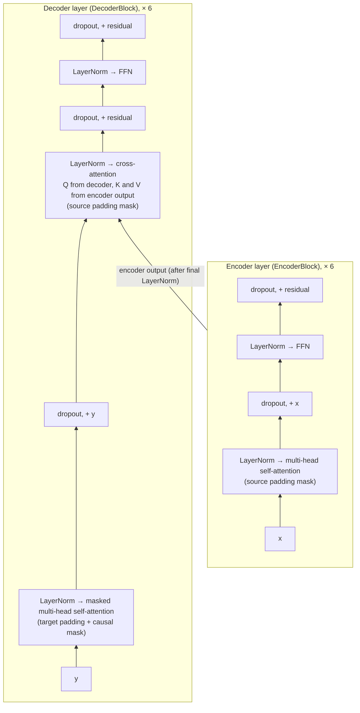
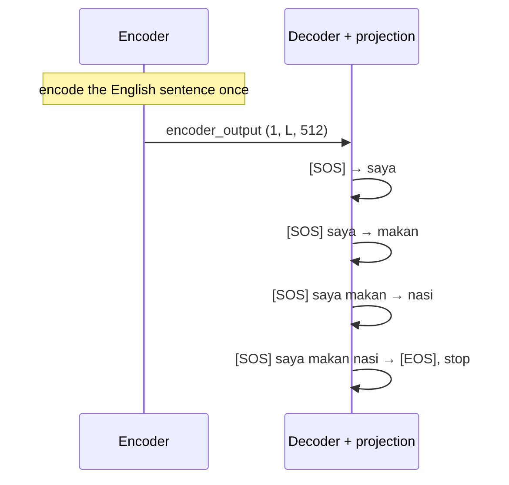

# How the Transformer Works: a walkthrough of "Attention Is All You Need"

This report explains the original Transformer (Vaswani et al., 2017) section by section, using the code in this folder as the running example. Each idea is presented in three parts: what the paper says (with section and equation numbers), the maths, and the code that implements it.

- **Paper:** Vaswani, Shazeer, Parmar, Uszkoreit, Jones, Gomez, Kaiser, Polosukhin, *Attention Is All You Need*, NeurIPS 2017, [arXiv:1706.03762](https://arxiv.org/abs/1706.03762). All quotes and numbers are from **arXiv version 7 (August 2023)**.
- **Task in this repo:** English → Indonesian translation on the OPUS-100 corpus (the paper used WMT 2014 English → German and English → French).
- **How to run the code:** see [README.md](README.md). This document only covers how the model works.

## Contents

1. [The big picture](#1-the-big-picture)
2. [Notation and shapes](#2-notation-and-shapes)
3. [Input embeddings (§3.4)](#3-input-embeddings-34)
4. [Positional encoding (§3.5)](#4-positional-encoding-35)
5. [Scaled dot-product attention (§3.2.1, Eq. 1)](#5-scaled-dot-product-attention-321-eq-1)
6. [Multi-head attention (§3.2.2)](#6-multi-head-attention-322)
7. [Three uses of attention and their masks (§3.2.3)](#7-three-uses-of-attention-and-their-masks-323)
8. [Position-wise feed-forward network (§3.3, Eq. 2)](#8-position-wise-feed-forward-network-33-eq-2)
9. [Residual connections and layer normalization (§3.1)](#9-residual-connections-and-layer-normalization-31)
10. [The encoder and decoder stacks (§3.1)](#10-the-encoder-and-decoder-stacks-31)
11. [Output projection, softmax and weight sharing (§3.4)](#11-output-projection-softmax-and-weight-sharing-34)
12. [Training (§5)](#12-training-5)
13. [Inference: generating a translation](#13-inference-generating-a-translation)
14. [Hyperparameters: paper vs. this repo](#14-hyperparameters-paper-vs-this-repo)
15. [Where this implementation differs from the paper](#15-where-this-implementation-differs-from-the-paper)
16. [References](#16-references)

---

## 1. The big picture

Before the Transformer, the best translation models were **recurrent** (RNNs, LSTMs): they read a sentence one word at a time and carry a hidden state forward. That has two problems:

- **No parallelism over positions.** Step $t$ needs the hidden state from step $t-1$, so a sentence of length $n$ needs $n$ sequential steps, in training as well as in inference.
- **Long paths between words.** Information from word 1 must pass through every intermediate state to reach word 50, and it fades along the way.

The paper's proposal is to drop recurrence entirely and let every position look at every other position directly through **attention**. Table 1 of the paper compares the cost per layer:

| Layer type | Complexity per layer | Sequential operations | Maximum path length |
|---|---|---|---|
| Self-attention | $O(n^2 \cdot d)$ | $O(1)$ | $O(1)$ |
| Recurrent | $O(n \cdot d^2)$ | $O(n)$ | $O(n)$ |
| Convolutional | $O(k \cdot n \cdot d^2)$ | $O(1)$ | $O(\log_k n)$ |

Self-attention connects any two positions in one step, and all positions are computed at once. The price is the $n^2$ term: every position compares itself with every other position.

The model keeps the classic **encoder–decoder** layout (§3). The encoder reads the whole English sentence and turns it into a sequence of vectors. The decoder generates the Indonesian sentence one token at a time; it is **auto-regressive**, "consuming the previously generated symbols as additional input when generating the next."



In code, the whole model is the [`Transformer`](model.py#L217) class with three methods that mirror the diagram: [`encode`](model.py#L229), [`decode`](model.py#L234) and [`project`](model.py#L239). [`build_transformer`](model.py#L243) wires all the pieces together.

## 2. Notation and shapes

| Symbol | Meaning | Paper (base) | This repo |
|---|---|---|---|
| $B$ | batch size (sentences) | ~25k tokens per batch | 8 sentences (`batch_size`) |
| $L$ | padded sequence length | variable | 350 (`seq_len`) |
| $d_{model}$ | width of every vector in the model | 512 | 512 (`d_model`) |
| $h$ | number of attention heads | 8 | 8 |
| $d_k = d_v$ | width of one head, $d_{model}/h$ | 64 | 64 |
| $d_{ff}$ | hidden width of the feed-forward layer | 2048 | 2048 |
| $N$ | layers in the encoder and in the decoder | 6 | 6 |
| $V$ | vocabulary size | ~37k (shared BPE) | 30,000 per language (word-level) |

The code comments track tensor shapes, for example `(batch, seq_len, d_model)`. Most of the model takes a `(B, L, d_model)` tensor and returns one of the same shape. That is what lets the layers be stacked and added together through residual connections.

## 3. Input embeddings (§3.4)

A token id is just an integer. The embedding layer is a learned lookup table of shape $(V, d_{model})$: row $i$ is the vector for token $i$.

The paper adds one detail: "In the embedding layers, we multiply those weights by $\sqrt{d_{model}}$." The paper does not explain why. A common reading: the positional encodings added next have values in $[-1, 1]$, while embedding entries are small (especially when the matrix is shared with the output layer, see [§11](#11-output-projection-softmax-and-weight-sharing-34)). Scaling by $\sqrt{512} \approx 22.6$ keeps the token signal from being drowned out by the position signal.

```python
# model.py — InputEmbeddings.forward
return self.embedding(x) * math.sqrt(self.d_model)   # (B, L) -> (B, L, d_model)
```

Code: [`InputEmbeddings`](model.py#L8).

## 4. Positional encoding (§3.5)

Attention, as defined below, treats its input as a **set**: shuffle the words and every output is shuffled the same way, with no other change. Word order has to be injected explicitly. The paper adds a fixed **sinusoidal positional encoding** to each embedding:

$$
PE_{(pos,\,2i)} = \sin\!\left(\frac{pos}{10000^{2i/d_{model}}}\right), \qquad
PE_{(pos,\,2i+1)} = \cos\!\left(\frac{pos}{10000^{2i/d_{model}}}\right)
$$

Here $pos$ is the token's position and $i$ indexes pairs of dimensions. Each pair of dimensions is a sine/cosine wave with its own frequency $\omega_i = 10000^{-2i/d_{model}}$. The wavelengths form a geometric progression "from $2\pi$ to $10000 \cdot 2\pi$". The low dimensions change quickly from one position to the next, the high dimensions slowly, like the hands of a clock.

**Why sinusoids?** The authors chose them because "for any fixed offset $k$, $PE_{pos+k}$ can be represented as a linear function of $PE_{pos}$." You can check this with the angle-addition formulas. For a single frequency $\omega$:

$$
\begin{pmatrix} \sin(\omega(pos+k)) \\ \cos(\omega(pos+k)) \end{pmatrix}
=
\begin{pmatrix} \cos(\omega k) & \sin(\omega k) \\ -\sin(\omega k) & \cos(\omega k) \end{pmatrix}
\begin{pmatrix} \sin(\omega\, pos) \\ \cos(\omega\, pos) \end{pmatrix}
$$

Moving $k$ positions forward is a **rotation** whose angle depends only on $k$, not on $pos$. The hope was that this makes relative positions easy for the model to learn. (Llama 2's rotary embeddings take this idea further and apply the rotation directly to queries and keys; see the [Llama 2 report](../llama2-from-scratch/REPORT.md).)

The paper also tried **learned** position embeddings and got "nearly identical results" (Table 3, row E: BLEU 25.7 against 25.8). It kept sinusoids because they "may allow the model to extrapolate to sequence lengths longer than the ones encountered during training."

**Implementation.** The table is computed once, for all positions up to `seq_len`, and stored as a buffer: a tensor that is saved with the model but not trained. Computing $10000^{-2i/d}$ through `exp` and `log` is numerically safer than computing the power directly:

$$
10000^{-2i/d_{model}} = \exp\!\left(2i \cdot \frac{-\ln 10000}{d_{model}}\right)
$$

```python
# model.py — PositionEncoding.__init__
position = torch.arange(0, seq_len).unsqueeze(1)                                  # (L, 1)
div_term = torch.exp(torch.arange(0, d_model, 2) * (-math.log(10000.0) / d_model))  # (d_model/2,)  = ω_i
pe[:, 0::2] = torch.sin(position * div_term)   # even dimensions
pe[:, 1::2] = torch.cos(position * div_term)   # odd dimensions
```

The forward pass adds the first `L` rows to the embeddings and then applies dropout. The paper applies dropout "to the sums of the embeddings and the positional encodings" (§5.4).

Code: [`PositionEncoding`](model.py#L23).

## 5. Scaled dot-product attention (§3.2.1, Eq. 1)

Attention is the core of the model. The paper describes it as mapping "a query and a set of key-value pairs to an output". The output is a weighted sum of the **values**, and the weight on each value says how well its **key** matches the **query**.

An analogy: you (the query) walk into a library and compare your question with every book's title (the keys). You then read a blend of the books' contents (the values), weighted by how relevant each title looked.

With all queries, keys and values stacked into matrices $Q \in \mathbb{R}^{L_q \times d_k}$, $K \in \mathbb{R}^{L_k \times d_k}$ and $V \in \mathbb{R}^{L_k \times d_v}$:

$$
\operatorname{Attention}(Q, K, V) = \operatorname{softmax}\!\left(\frac{QK^\top}{\sqrt{d_k}}\right) V \tag{1}
$$

Step by step:

1. $QK^\top$ has shape $(L_q, L_k)$. Entry $(i, j)$ is the dot product of query $i$ with key $j$, a similarity score.
2. Divide by $\sqrt{d_k}$ (explained below).
3. Apply softmax along each row, turning the scores for query $i$ into weights that are positive and sum to 1.
4. Multiply by $V$: output row $i$ is the weighted average of the value vectors.

**Why divide by $\sqrt{d_k}$?** The paper's footnote 1 explains. Suppose the components of $q$ and $k$ are independent, with mean 0 and variance 1. Then

$$
q \cdot k = \sum_{i=1}^{d_k} q_i k_i \quad\text{has mean } 0 \text{ and variance } d_k .
$$

With $d_k = 64$, raw scores have a standard deviation of 8. Softmax over numbers that far apart is nearly one-hot, and the paper notes this pushes softmax "into regions where it has extremely small gradients". Dividing by $\sqrt{d_k}$ brings the variance back to 1.

**Masking.** Some query–key pairs must be forbidden: padding tokens, and in the decoder, future tokens. The paper does this "by masking out (setting to $-\infty$) all values in the input of the softmax which correspond to illegal connections". Since $e^{-\infty} = 0$, those keys get exactly zero weight. The code uses $-10^9$ instead of $-\infty$. The effect is the same, and it avoids the `NaN` that $-\infty - (-\infty)$ would produce if a whole row were masked.

```python
# model.py — MultiHeadAttentionBlock.attention
attention_scores = (query @ key.transpose(-2, -1)) / math.sqrt(d_k)   # (B, h, L_q, L_k)
if mask is not None:
    attention_scores.masked_fill_(mask == 0, -1e9)
attention_scores = attention_scores.softmax(dim=-1)
if dropout is not None:
    attention_scores = dropout(attention_scores)
return (attention_scores @ value), attention_scores                    # (B, h, L_q, d_k)
```

Code: [`MultiHeadAttentionBlock.attention`](model.py#L103). The dropout on the attention weights is **not** in the paper (§5.4 only lists residual and embedding dropout). It is a common addition, also used in later implementations.

## 6. Multi-head attention (§3.2.2)

A single attention operation produces one weighted average per position, and averaging blurs things together. The paper's argument: "With a single attention head, averaging inhibits" attending to several things at once, for example to a verb's subject and its object. **Multi-head attention** runs $h$ attention operations in parallel, each on its own learned projection of the input:

$$
\operatorname{MultiHead}(Q, K, V) = \operatorname{Concat}(\text{head}_1, \dots, \text{head}_h)\, W^O,
\qquad
\text{head}_i = \operatorname{Attention}(QW_i^Q,\; KW_i^K,\; VW_i^V)
$$

with $W_i^Q, W_i^K \in \mathbb{R}^{d_{model} \times d_k}$, $W_i^V \in \mathbb{R}^{d_{model} \times d_v}$ and $W^O \in \mathbb{R}^{h d_v \times d_{model}}$. The base model uses $h = 8$ and $d_k = d_v = 512/8 = 64$. Because each head is $h$ times narrower, "the total computational cost is similar to that of single-head attention with full dimensionality."

**Packing the heads.** The code does not create 8 separate small matrices. The 8 matrices $W_i^Q$ placed side by side form one $512 \times 512$ matrix, so a single `nn.Linear(d_model, d_model)` computes all 8 query projections at once. Reshaping then splits the 512 outputs into 8 heads of 64:



```python
# model.py — MultiHeadAttentionBlock.forward
query = self.w_q(q)                                                         # (B, L, d_model)
query = query.view(B, L, self.h, self.d_k).transpose(1, 2)                  # (B, h, L, d_k)
...
x, self.attention_scores = MultiHeadAttentionBlock.attention(query, key, value, mask, self.dropout)
x = x.transpose(1, 2).contiguous().view(B, -1, self.h * self.d_k)           # (B, L, d_model): concat heads
return self.w_o(x)
```

The attention weights are kept in `self.attention_scores`, so they can be inspected or visualised after a forward pass. The `nn.Linear` layers have bias terms, which the paper's equations leave out. This makes little practical difference.

Code: [`MultiHeadAttentionBlock`](model.py#L86).

## 7. Three uses of attention and their masks (§3.2.3)

The same attention block is used in three places. They differ only in where $Q$, $K$ and $V$ come from and in the mask:

| Where | Queries from | Keys and values from | Mask | Code |
|---|---|---|---|---|
| Encoder self-attention | encoder | encoder | padding of the source | [`EncoderBlock.forward`](model.py#L160) |
| Decoder masked self-attention | decoder | decoder | padding of the target **and** causal | [`DecoderBlock.forward`](model.py#L187) |
| Encoder–decoder (cross) attention | decoder | **encoder output** | padding of the source | [`DecoderBlock.forward`](model.py#L187) |

**Cross-attention** is how the decoder reads the source sentence. Each Indonesian position asks "which English words matter for me now?", and in the paper's words "every position in the decoder [can] attend over all positions in the input sequence."

**The padding mask.** Every sentence is padded with `[PAD]` up to `seq_len = 350`. Real tokens must never attend to padding. [`BilingualDataset`](dataset.py#L6) builds the mask as `(encoder_input != [PAD])` with shape `(1, 1, L)`. After batching it is `(B, 1, 1, L)`, which broadcasts over the 8 heads and over every query row, so it hides the padding **columns** (keys).

**The causal mask.** During training the decoder sees the whole target sentence at once, but position $i$ must not see positions after $i$. Otherwise it could just copy the answer. [`causal_mask`](dataset.py#L87) builds a lower-triangular matrix:

```python
def causal_mask(size):
    mask = torch.triu(torch.ones(1, size, size), diagonal=1).type(torch.int)   # 1s strictly above the diagonal
    return mask == 0                                                         # True on and below the diagonal
```

For a 4-token target (`1` = may attend):

| query \ key | 0 | 1 | 2 | 3 |
|---|---|---|---|---|
| **0** | 1 | 0 | 0 | 0 |
| **1** | 1 | 1 | 0 | 0 |
| **2** | 1 | 1 | 1 | 0 |
| **3** | 1 | 1 | 1 | 1 |

The decoder's mask is the logical AND of this matrix with the target padding mask, giving shape `(B, 1, L, L)`. The paper adds that "this masking, combined with [the] fact that the output embeddings are offset by one position, ensures that the predictions for position $i$ can depend only on the known outputs at positions less than $i$." The offset is covered in [§12](#12-training-5).

## 8. Position-wise feed-forward network (§3.3, Eq. 2)

After attention has mixed information **between** positions, each position is processed **on its own** by a small two-layer network:

$$
\operatorname{FFN}(x) = \max(0,\; xW_1 + b_1)\,W_2 + b_2 \tag{2}
$$

The inner layer is four times wider ($d_{ff} = 2048$) than the model width, with a ReLU in between. The same weights are used at every position, which the paper compares to "two convolutions with kernel size 1". Each layer has its own weights. Attention decides *what information to gather*; the FFN is where most per-token computation happens. It holds two thirds of each encoder layer's parameters.

```python
# model.py — FeedForwardBlock.forward
return self.linear_2(self.dropout(torch.relu(self.linear_1(x))))   # (B, L, 512) -> (B, L, 2048) -> (B, L, 512)
```

Code: [`FeedForwardBlock`](model.py#L71). The dropout between the two layers is another addition that is not in the paper.

## 9. Residual connections and layer normalization (§3.1)

Every sub-layer (attention or FFN) is wrapped in a **residual connection** followed by **layer normalization**. The paper writes the output of each sub-layer as

$$
\operatorname{LayerNorm}(x + \operatorname{Sublayer}(x)),
$$

and §5.4 adds dropout on the sub-layer's output "before it is added to the sub-layer input and normalized". In full: $\operatorname{LayerNorm}(x + \operatorname{Dropout}(\operatorname{Sublayer}(x)))$.

- The **residual** $x + \dots$ gives gradients a direct path through the network, so a 6-layer stack (12 or 18 sub-layers) can be trained at all.
- **Layer normalization** rescales each token's vector to mean 0 and variance 1, then applies a learned scale $\gamma$ (`alpha` in the code) and shift $\beta$ (`bias`):

$$
\operatorname{LayerNorm}(x) = \gamma \odot \frac{x - \mu}{\sqrt{\sigma^2 + \epsilon}} + \beta,
\qquad \mu = \frac{1}{d}\sum_j x_j,\quad \sigma^2 = \frac{1}{d}\sum_j (x_j - \mu)^2
$$

### Pre-norm vs. post-norm: a deliberate deviation

This repo puts the normalization **inside** the residual branch, an arrangement called **Pre-LN**:

$$
\text{paper (Post-LN):}\quad x_{l+1} = \operatorname{LayerNorm}(x_l + \operatorname{Sublayer}(x_l))
\qquad
\text{this repo (Pre-LN):}\quad x_{l+1} = x_l + \operatorname{Sublayer}(\operatorname{LayerNorm}(x_l))
$$

```python
# model.py — ResidualConnection.forward
return x + self.dropout(sublayer(self.norm(x)))
```

Because the residual stream $x$ itself is never normalised in Pre-LN, [`Encoder`](model.py#L165) and [`Decoder`](model.py#L193) each apply one final `LayerNormalization` after their last layer.

Why keep this? Xiong et al. (2020), *On Layer Normalization in the Transformer Architecture* ([arXiv:2002.04745](https://arxiv.org/abs/2002.04745)), analysed both variants:

- **Theorem 1:** at initialisation, the gradient of the last layer's FFN weights in Post-LN is $O(d\sqrt{\ln d})$, independent of depth $L$. In Pre-LN it is $O(d\sqrt{\ln d / L})$, which shrinks as the model gets deeper.
- So Post-LN has large gradients near the output at the start of training, and **needs the learning-rate warm-up of Eq. 3 to avoid diverging**. On IWSLT14 De–En, Post-LN without warm-up reached only 8.45 BLEU, against about 34 with warm-up.
- Pre-LN trains stably even without warm-up and converges faster.

This is why almost every later Transformer (GPT-2 onward, Llama) uses pre-norm. This repo keeps the paper's warm-up schedule anyway ([§12](#12-training-5)); with pre-norm it is a safety margin rather than a necessity. Existing checkpoints in `weights/` were also trained with pre-norm.

**A second, smaller difference** is in [`LayerNormalization`](model.py#L55), which computes $\gamma \odot (x-\mu)/(\sigma + \epsilon) + \beta$. It uses `torch.std`, which divides by $d-1$ instead of $d$, and adds $\epsilon$ outside the square root. With $d = 512$ the numerical difference from `nn.LayerNorm` is tiny.

## 10. The encoder and decoder stacks (§3.1)

**Encoder layer** = self-attention → FFN, each in a residual block. **Decoder layer** = masked self-attention → cross-attention → FFN, each in a residual block. Both stacks have $N = 6$ identical layers (identical in shape; each has its own weights).



```python
# model.py — DecoderBlock.forward
x = self.residual_connections[0](x, lambda x: self.self_attention_block(x, x, x, tgt_mask))
x = self.residual_connections[1](x, lambda x: self.cross_attention_block(x, encoder_output, encoder_output, src_mask))
x = self.residual_connections[2](x, self.feed_forward_block)
```

Every decoder layer uses the **final** encoder output for its cross-attention, not the output of the encoder layer at the same depth.

Code: [`EncoderBlock`](model.py#L151), [`Encoder`](model.py#L165), [`DecoderBlock`](model.py#L178), [`Decoder`](model.py#L193). With $d_{model}=512$, each encoder layer has 3.15M parameters and each decoder layer 4.20M (the extra attention block).

## 11. Output projection, softmax and weight sharing (§3.4)

The decoder outputs one 512-wide vector per position. A final linear layer maps it to $V$ scores (logits), one per vocabulary word, and softmax turns them into next-token probabilities. The code returns logits only; the softmax is folded into the loss during training and replaced by `argmax` during decoding.

```python
# model.py — ProjectionLayer.forward
return self.proj(x)   # (B, L, d_model) -> (B, L, vocab_size)
```

**Weight sharing.** The paper states: "we share the same weight matrix between the two embedding layers and the pre-softmax linear transformation." The embedding maps *token → vector* and the projection maps *vector → score for each token*. Both are $V \times d_{model}$ tables of "what each token looks like", so tying them saves parameters and lets each improve the other.

The paper can share **one** matrix three ways because it uses a single BPE vocabulary of about 37k tokens for both languages (§5.1). This repo has **separate** English and Indonesian vocabularies, so only the target embedding and the projection can be tied:

```python
# model.py — build_transformer
if share_weights:
    projection_layer.proj.weight = tgt_embed.embedding.weight   # one Parameter, used twice
```

This is controlled by `share_weights` in [`config.py`](config.py) (default `True`). With tying the model has **74.9M** parameters; without it, 90.3M. The paper's base model has 65M because its single shared matrix is counted once. A tied checkpoint stores the same tensor under both names, which is how [`checkpoint_shares_weights`](model.py#L295) recognises one. `train.py` and `translate.py` use it to rebuild the model the way the checkpoint was trained.

## 12. Training (§5)

### Teacher forcing: inputs shifted by one

In training the decoder sees the correct target sentence, shifted right by one position, and must predict the next token at every position at once. This is called *teacher forcing*. [`BilingualDataset.__getitem__`](dataset.py#L31) builds three sequences per sentence pair:

| Tensor | Contents (`saya makan nasi` = "I eat rice") |
|---|---|
| `encoder_input` | `[SOS] i eat rice [EOS] [PAD] …` |
| `decoder_input` | `[SOS] saya makan nasi [PAD] …` |
| `label` | `saya makan nasi [EOS] [PAD] …` |

Position 0 of the decoder sees `[SOS]` and must predict `saya`. Position 1 sees `[SOS] saya` and must predict `makan`, and so on. The causal mask ([§7](#7-three-uses-of-attention-and-their-masks-323)) guarantees that position $i$ cannot peek at `label[i]` through `decoder_input[i+1]`. As a result, one forward pass trains all $L$ next-token predictions in parallel. This is the parallelism advantage from [§1](#1-the-big-picture).


### Loss and label smoothing (§5.4)

The loss is the cross-entropy between the predicted distribution and the label at every non-padding position. The paper uses **label smoothing** with $\epsilon_{ls} = 0.1$. Instead of demanding 100% probability on the correct token, the target distribution becomes

$$
q(k) = (1 - \epsilon_{ls})\,\mathbb{1}[k = y] + \frac{\epsilon_{ls}}{V}
$$

(this is PyTorch's form, which spreads $\epsilon_{ls}$ evenly over all $V$ classes). The paper notes: "This hurts perplexity, as the model learns to be more unsure, but improves accuracy and BLEU score."

```python
# train.py — train_model
loss_fn = nn.CrossEntropyLoss(ignore_index=tokenizer_tgt.token_to_id('[PAD]'), label_smoothing=0.1)
loss = loss_fn(proj_output.view(-1, tgt_vocab_size), label.view(-1))
```

### Optimizer and learning-rate schedule (§5.3, Eq. 3)

The paper trains with Adam ($\beta_1 = 0.9$, $\beta_2 = 0.98$, $\epsilon = 10^{-9}$) and a learning rate that changes every step:

$$
lrate = d_{model}^{-0.5} \cdot \min\!\left(step^{-0.5},\; step \cdot warmup\_steps^{-1.5}\right) \tag{3}
$$

with $warmup\_steps = 4000$. The rate **rises linearly** for 4000 steps, then **decays** like $1/\sqrt{step}$. The two branches of the `min` meet exactly at $step = warmup\_steps$. For $d_{model} = 512$:

| step | 1 | 1,000 | 4,000 (peak) | 16,000 | 100,000 |
|---|---|---|---|---|---|
| learning rate | $1.7 \times 10^{-7}$ | $1.7 \times 10^{-4}$ | $7.0 \times 10^{-4}$ | $3.5 \times 10^{-4}$ | $1.4 \times 10^{-4}$ |

Warm-up exists because Adam's early update sizes are unreliable (its moment estimates start at zero) and because Post-LN gradients near the output start out large ([§9](#9-residual-connections-and-layer-normalization-31)).

```python
# train.py
def learning_rate(step, d_model, warmup_steps, factor=1.0):
    step = max(step, 1)
    return factor * d_model ** -0.5 * min(step ** -0.5, step * warmup_steps ** -1.5)

# inside the training loop, before optimizer.step():
lr = learning_rate(global_step + 1, config['d_model'], config['warmup_steps'], config['lr_factor'])
for group in optimizer.param_groups:
    group['lr'] = lr
```

The rate depends only on `global_step`, which every checkpoint stores, so a resumed run continues on the same curve. The settings are `warmup_steps`, `lr_factor`, `adam_betas` and `adam_eps` in [`config.py`](config.py), and the curve is logged to TensorBoard as `learning rate`.

### Regularization (§5.4)

- **Residual dropout**, $P_{drop} = 0.1$: on each sub-layer's output before the residual addition ([`ResidualConnection`](model.py#L139)) and on embeddings plus positional encodings ([`PositionEncoding`](model.py#L23)).
- **Label smoothing** $\epsilon_{ls} = 0.1$ (above).
- This repo also applies dropout to the attention weights and inside the FFN. Neither is in the paper.

The paper's base model trained for 100,000 steps (about 12 hours on 8 P100 GPUs) on batches of about 25,000 source and 25,000 target tokens. This repo's default batch of 8 sentences, padded to 350 tokens, is much smaller. Most of those 350 positions are padding: 99% of the OPUS-100 sentences are 38 tokens or shorter.

## 13. Inference: generating a translation

At inference time the target sentence is unknown, so the decoder runs **auto-regressively**. [`greedy_decode`](translate.py#L12):

1. Encode the source once: `encoder_output = model.encode(source, source_mask)`.
2. Start the target with `[SOS]`.
3. Run the decoder on everything generated so far, under a causal mask. Take the logits at the **last** position and pick the most likely token (`argmax`).
4. Append it. Stop at `[EOS]` or when `seq_len` tokens have been generated; otherwise go back to step 3.



This simple decoder recomputes the whole target prefix at every step, so producing $n$ tokens costs $O(n^2)$ decoder positions in total. Decoder-only models such as Llama cache the keys and values of earlier positions to avoid this (the **KV cache**, explained in the [Llama 2 report](../llama2-from-scratch/REPORT.md)).

The same function is used in two places: [`run_validation`](train.py#L107), which prints 2 example translations after every epoch and logs them to TensorBoard, and the [`translate.py`](translate.py) command-line tool.

The paper decoded differently (§6.1). It used **beam search** with beam size 4 and length penalty $\alpha = 0.6$, and it **averaged the last 5 checkpoints** of the base model. Neither is implemented here; greedy decoding is the simplest correct decoder.

## 14. Hyperparameters: paper vs. this repo

| Hyperparameter | Paper base model (Table 3, §5) | This repo (`config.py`, `build_transformer`) |
|---|---|---|
| Layers $N$ | 6 | 6 |
| $d_{model}$ / $d_{ff}$ / $h$ / $d_k$ | 512 / 2048 / 8 / 64 | 512 / 2048 / 8 / 64 |
| Dropout $P_{drop}$ | 0.1 | 0.1 (plus attention-weight and FFN dropout) |
| Label smoothing | 0.1 | 0.1 |
| Optimizer | Adam, $\beta = (0.9, 0.98)$, $\epsilon = 10^{-9}$ | same |
| Learning rate | Eq. 3, warm-up 4000 | Eq. 3, warm-up 4000 (`lr_factor` 1.0) |
| Normalization | Post-LN | **Pre-LN** + final LayerNorm |
| Vocabulary | shared BPE, ~37k | word-level, 30k per language, `min_frequency=2` |
| Weight sharing | both embeddings + projection | target embedding + projection |
| Batch | ~25k + 25k tokens | 8 sentence pairs, padded to 350 |
| Data | WMT14 EN–DE (4.5M pairs) | OPUS-100 EN–ID (1M pairs, 90/10 train/validation split) |
| Parameters | 65M | 74.9M (tied) |
| Decoding | beam 4, $\alpha = 0.6$, average of last 5 checkpoints | greedy |
| Reported quality | 27.3 BLEU EN–DE (newstest2014, Table 2) | not measured |

## 15. Where this implementation differs from the paper

| # | Difference | Why / impact |
|---|---|---|
| 1 | **Pre-LN** instead of Post-LN, plus a final LayerNorm per stack | Trains more stably (Xiong et al., 2020); the standard choice since GPT-2. Existing checkpoints depend on it. |
| 2 | LayerNorm divides by $\sigma + \epsilon$ using unbiased `std` | Numerically almost identical to standard LayerNorm. |
| 3 | Separate English and Indonesian vocabularies; only target embedding ↔ projection are tied | The paper's three-way tying needs one shared vocabulary. Set `share_weights=False` to load untied checkpoints. |
| 4 | Word-level tokenizers instead of BPE | Simpler to follow, but rare words become `[UNK]`. |
| 5 | Extra dropout on attention weights and inside the FFN | Mild extra regularization, common in other implementations. |
| 6 | Biases in the attention projections; the projection layer keeps its own bias | Not in the paper's equations; negligible effect. |
| 7 | Fixed padding to `seq_len = 350` with small sentence batches | Wastes computation on padding; the paper batched by length and counted batches in tokens. |
| 8 | Greedy decoding, no checkpoint averaging | Beam search and BLEU evaluation are out of scope for this repo. |

Everything else (scaled dot-product attention, multi-head attention, the three attention types and their masks, the FFN, sinusoidal positions, embedding scaling, label smoothing, Adam settings and the warm-up schedule) follows the paper.

## 16. References

- Vaswani et al. (2017). *Attention Is All You Need.* NeurIPS. [arXiv:1706.03762](https://arxiv.org/abs/1706.03762) (cited from v7). Note that the big model's EN–FR score is given as 41.0 in the §6.1 text but 41.8 in Table 2 of v7.
- Xiong et al. (2020). *On Layer Normalization in the Transformer Architecture.* ICML. [arXiv:2002.04745](https://arxiv.org/abs/2002.04745).
- Ba, Kiros, Hinton (2016). *Layer Normalization.* [arXiv:1607.06450](https://arxiv.org/abs/1607.06450).
- Szegedy et al. (2016). *Rethinking the Inception Architecture for Computer Vision* (introduces label smoothing). [arXiv:1512.00567](https://arxiv.org/abs/1512.00567).
- Tiedemann et al. *OPUS-100* dataset, [Helsinki-NLP/opus-100](https://huggingface.co/datasets/Helsinki-NLP/opus-100) on Hugging Face.
